<p align="center">
  
</p>

# Vanchor-NG

> **v1.0-alpha** — the start of a new major version. Vanchor-NG is a ground-up,
> software-first rewrite that **replaces the original [Vanchor](https://github.com/AlexAsplund/Vanchor) (0.1-alpha)**.

## What it is

Vanchor-NG turns a cheap **trolling motor** into a GPS-guided autopilot and
anchor system. Drop a **virtual anchor** to hold a spot, **hold a heading** like
a real autopilot, or tap the map and say **"take me here"** — the boat plans a
water-only route around islands and steers itself there, correcting for wind and
current drift along the way.

**New here?** The **[getting-started guide](docs/getting-started.md)** takes you from zero to a simulated boat holding anchor in about ten minutes — no hardware, no coding experience needed.

**Prefer to watch first?** Open the **[3D concept walkthrough](docs/concept/index.html)** — a 90-second holographic film of the whole control loop (drop an anchor, drift, aim, thrust, re-lock), straight in your browser, fully offline.

The headline is that **it runs entirely in simulation, with no hardware at all.**
A built-in physics simulator and simulated NMEA sensors close the control loop on
your laptop, so the whole navigation/control stack can be developed and tested
without a boat, a Pi, or a single wire. When you do have hardware, the same code
drives it — only the device construction changes.

It is a **PWA** (Progressive Web App): installable, works offline, and served by
the boat's own Raspberry Pi.

> **This is 1.0-alpha** — a from-scratch rewrite that supersedes the 0.1-alpha project.
> See [`RELEASE.md`](RELEASE.md) for release notes and migration notes.

## ⚓ The virtual anchor

**Vanchor = Virtual Anchor.** The headline feature: tap a spot and the boat
*holds it* — GPS station-keeping on a cheap trolling motor, no ground tackle.
It anticipates wind and current drift (crabbing to stay put rather than
orbiting), snaps back if pushed outside a watch circle you set, and takes a
**jog** to nudge the hold point a metre at a time. A rolling **hold-quality**
readout (RMS error, % of time inside the circle) lets you compare how tightly
it's holding.

Two station-keepers are available, and you can switch between them live:

- **Robust PID (default)** — a hand-tuned deadband/drive/reverse law: idle in
  the middle of the circle, drive back toward the mark when pushed out, back
  *straight* up when the mark is astern (no wasteful looping). Predictable and
  dependable.
- **Learned ML station-keeper (opt-in)** — a tiny neural net that *refines* the
  PID rather than replacing it: the command is `clip(pid + 0.3 · net(obs))`, so
  the **worst case is just the PID**. The net is a ~1.6k-parameter tanh MLP
  (8-dim body-frame observation × 4 stacked frames → 32 → 16 → 2), small enough
  to run on the Raspberry Pi as a few microsecond numpy matrix multiplies —
  **no ML runtime, no GPU**. It's trained offline by **Evolution Strategies**
  (gradient-free, numpy-only) against the exact Fossen 3-DOF physics across
  thousands of randomised scenarios — wind 0–12 m/s with gusts, current up to
  ~1.2 m/s, and the boat itself (mass, hull, motor power, bow/stern/centre
  mount). A runtime **guardrail** watches the actual hold and decays the net's
  influence back toward the pure PID if it ever underperforms. Net result vs
  the PID baseline: an equally tight (slightly tighter) hold at **3–4× less
  motor energy** — easier on the battery while anchored — across bow *and*
  stern mounts.

- **Thrust vectoring (opt-in)** — normally the autopilot only steers within a
  ±35° band; vectored station-keeping instead swings the motor through its
  **full rotation** to push *directly* against the wind/current, instead of
  reorienting the whole hull first. In a beam set that tightens the hold
  dramatically (measured RMS radial error **3.3 m → 1.3 m**, 100 % of the time
  inside the circle), and it's stable on bow and stern mounts alike.

> Everything above runs in the [built-in simulator](#sim-first) with no hardware
> — you can watch the anchor hold against a gusting beam current on your laptop.

## Hardware — the boat build

Vanchor-NG runs on any single-board computer that can reach a motor + steering
driver over serial/GPIO — wire it up however suits your boat. If you'd rather
not design that part yourself, the companion
**[vanchor-pcb](https://github.com/AlexAsplund/vanchor-pcb)** project is an
easy, ready-made option: an open-hardware carrier board (~$41, 12 V,
125 × 95 mm) that drops an **Orange Pi Zero 3** (or a Raspberry Pi) running
Vanchor-NG next to a **Raspberry Pi Pico 2** real-time motor controller, with
an on-board servo bridge, a cabled trolling-motor **thrust-driver board**,
headers for the **HWT901B** compass/IMU and GPS, and an optional
**NMEA 2000 / CAN** provision. The Pico holds the **hardware deadman** — it
ramps the motor to neutral if Vanchor-NG stops talking, so STOP survives a
computer crash. It's just one convenient way to build the helm, not a
requirement — and nothing here is needed to *try* Vanchor-NG, which is
[sim-first](#sim-first).

> ⚠️ **The vanchor-pcb board is in its prototype stage** — under active
> development, not yet built and validated on the water. Treat the design as a
> work in progress: review it yourself before ordering or wiring anything.

A typical build wired that way:

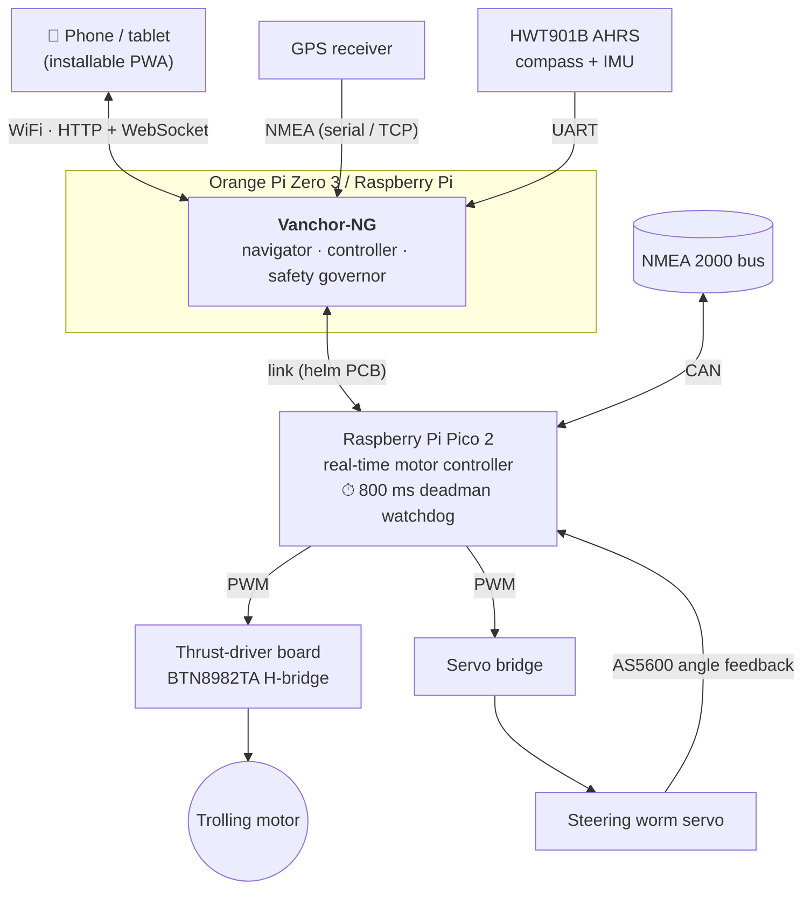
```mermaid
graph TD
    TAB["📱 Phone / tablet<br/>(installable PWA)"] <-->|"WiFi · HTTP + WebSocket"| VNG
    subgraph SBC["Orange Pi Zero 3 / Raspberry Pi"]
      VNG["<b>Vanchor-NG</b><br/>navigator · controller · safety governor"]
    end
    GPS["GPS receiver"] -->|"NMEA (serial / TCP)"| VNG
    HWT["HWT901B AHRS<br/>compass + IMU"] -->|"UART"| VNG
    VNG <-->|"link (helm PCB)"| PICO["Raspberry Pi Pico 2<br/>real-time motor controller<br/>⏱ 800 ms deadman watchdog"]
    N2K[("NMEA 2000 bus")] <-->|"CAN"| PICO
    PICO -->|"PWM"| TD["Thrust-driver board<br/>BTN8982TA H-bridge"] --> MOT(("Trolling motor"))
    PICO -->|"PWM"| SRV["Servo bridge"] --> WORM["Steering worm servo"]
    WORM -->|"AS5600 angle feedback"| PICO
```

The steering end is a 3D-printable **worm-gear steering servo** — a small
gearmotor turns a worm that swings the trolling-motor shaft (self-locking, so it
holds a heading with the motor idle), with an **AS5600** magnetic encoder for
absolute angle feedback. STLs, an assembly gallery, and build/waterproofing notes
live in the dedicated [vanchor-cad](https://github.com/AlexAsplund/vanchor-cad) repo — the current revision is sealed (twin lip seals + silicone-gasket lid) and fully 3D-printable.

## Screenshots

| | |
|:---:|:---:|
| 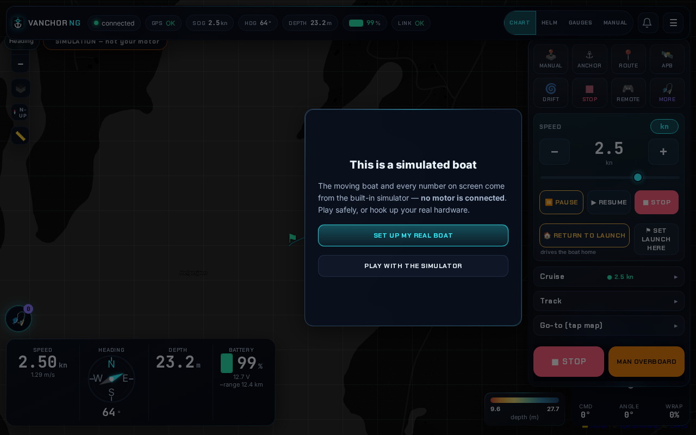 | 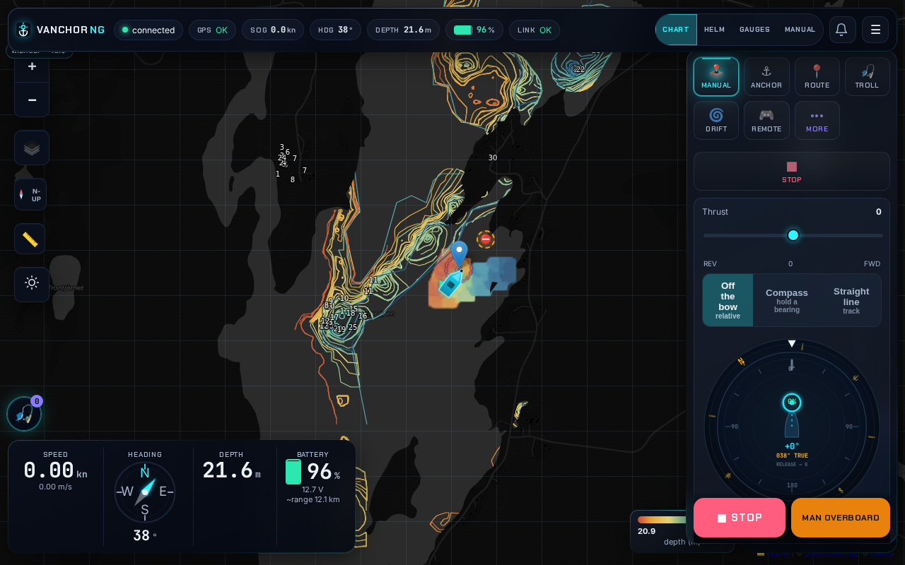 |
| **Main view** — boat, instrument HUD, mode dock, steering gauge | **Depth mapping** — colour-ramped grid with radiating coverage + isobath contours |
| 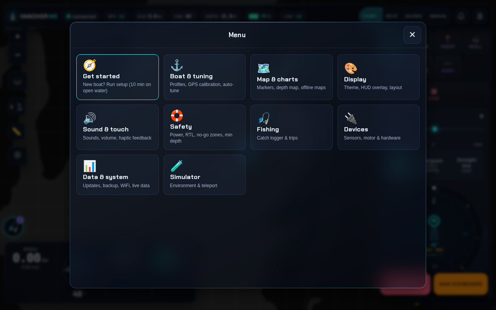 | 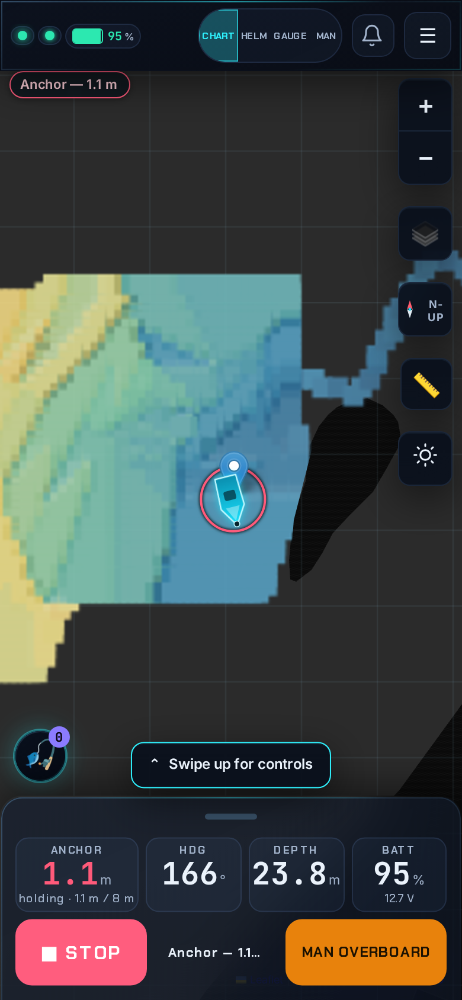 |
| **Menu** — a centred command menu: 8 large category tiles open big, thumb-friendly sub-panels | **Mobile** — full-bleed map + a draggable bottom sheet; picking a mode slides its options up |

> All four run on the **built-in simulator** — no hardware, no boat, just `vanchor` on a laptop.

### Views — specialised, URL-addressable layouts

Reach any view at **`/view/<name>`** — deep-linkable and offline-capable. Each drops
the chart and rearranges the same live widgets for a job at the helm; every view
keeps an ever-present STOP.

| | | |
|:---:|:---:|:---:|
| 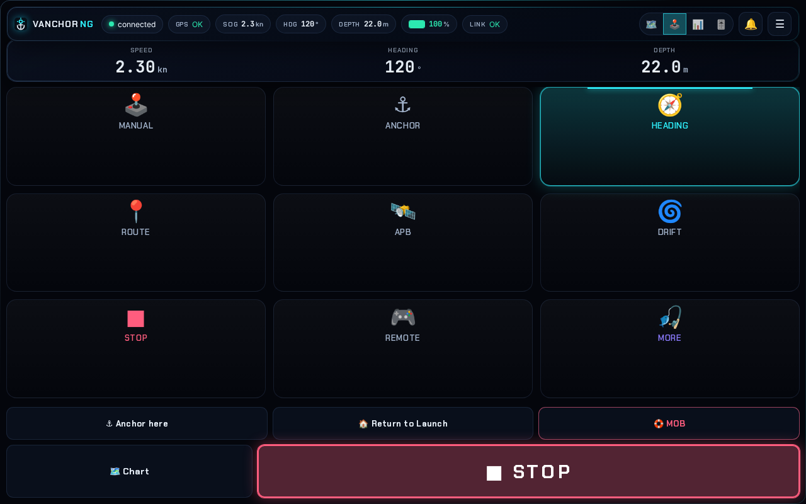 | 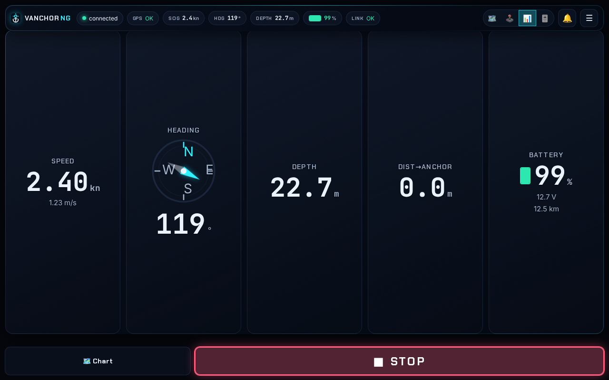 | 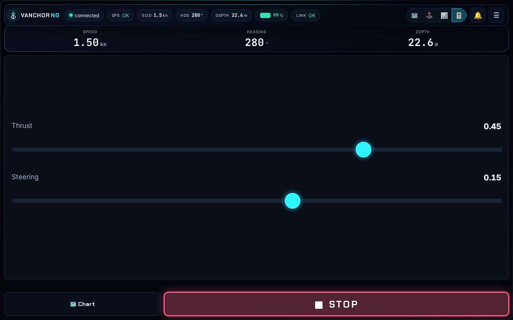 |
| **Helm** (`/view/helm`) — big mode grid, quick actions, dominant STOP | **Instruments** (`/view/instruments`) — a large glance HUD | **Manual** (`/view/manual`) — big thrust + steering |

An opt-in **Daylight** high-contrast theme keeps it readable in direct sun (dark stays default):

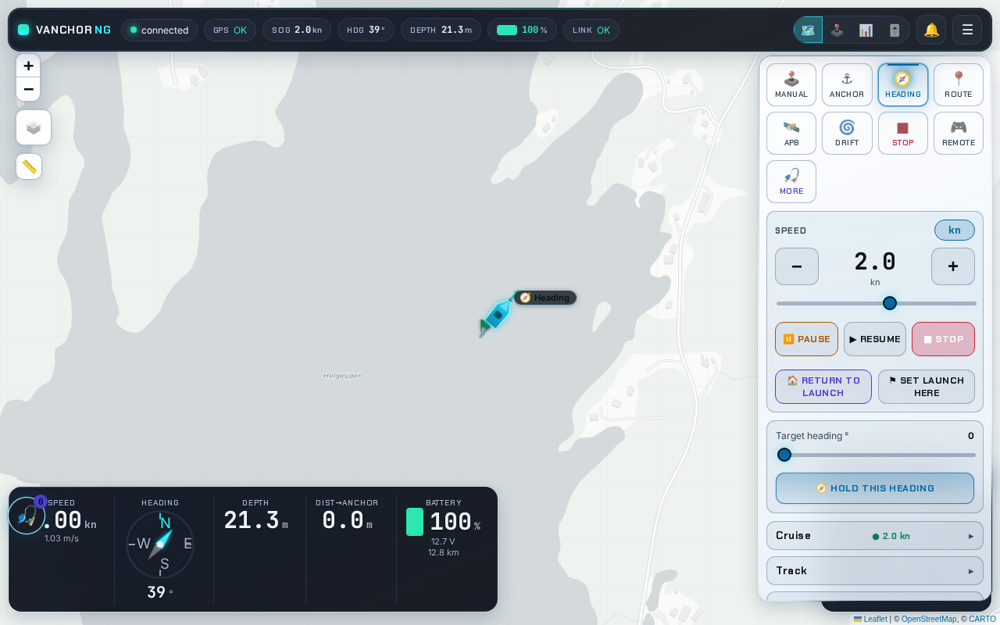

### A few of the modes

| | |
|:---:|:---:|
| 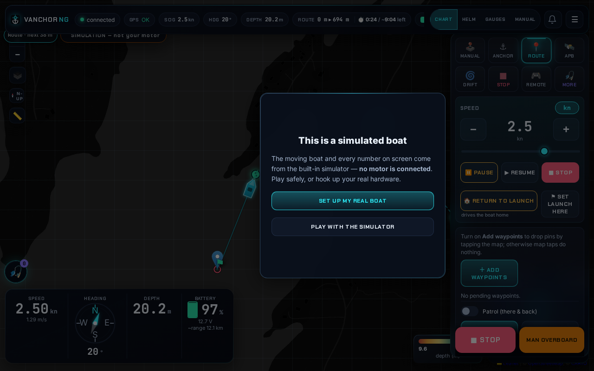 | 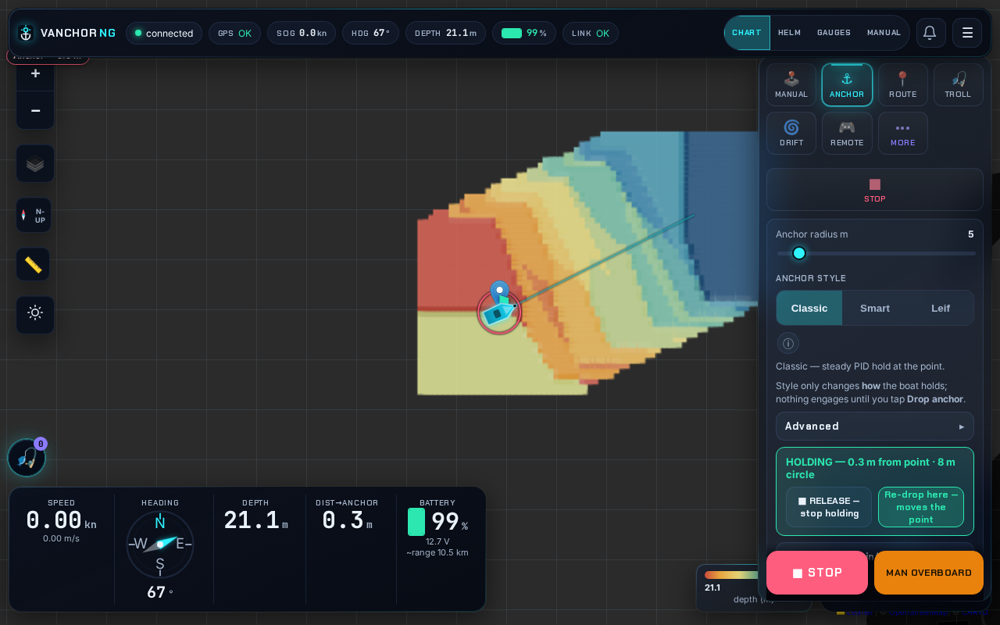 |
| **Route** — build a path or tap "take me here"; smart water-only routing, with Loop / Patrol | **Anchor hold** — drop a virtual anchor and hold the spot, with a nudge jog |
| 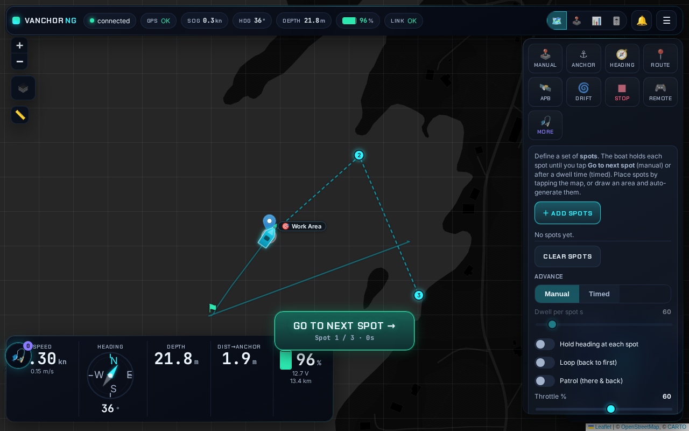 | 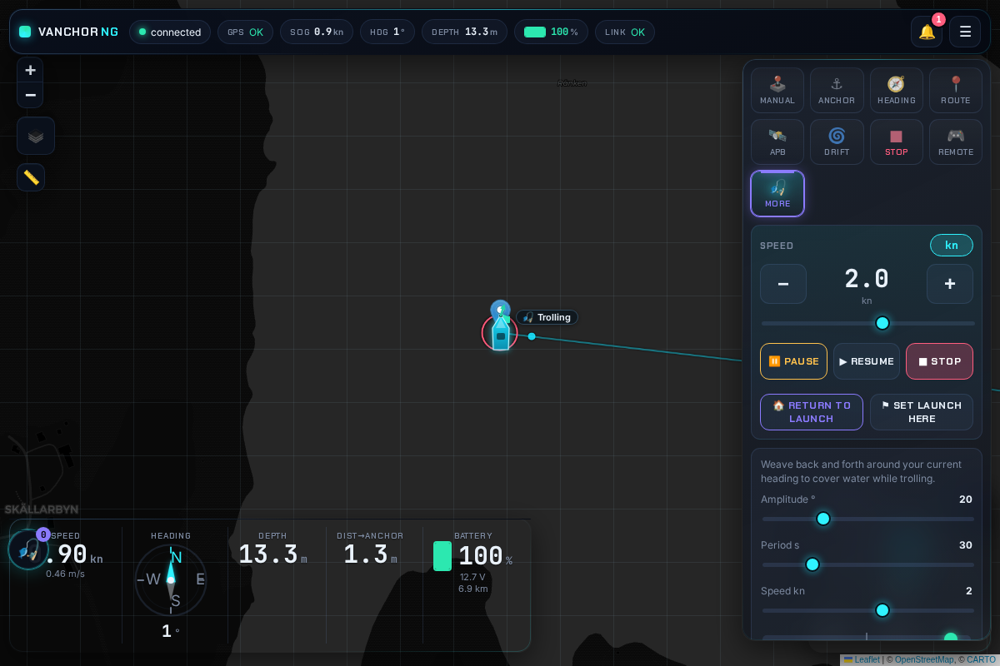 |
| **Work Area** — visit a set of spots, hold at each, advance on a timer or the big button | **Trolling** — a sinusoidal S-curve weave at a held speed |

> One guide per mode lives in **[`docs/modes/`](docs/modes/)**.

## Highlights

**Navigation & control**

- **Virtual GPS anchoring (position hold)** — drop a virtual anchor and hold the spot,
  with heading-aware drift anticipation and an *anchor jog* to nudge the hold point.
- **Autopilot heading-hold** — set a compass heading and hold it.
- **Waypoint navigation** with cross-track correction and predictive drift
  compensation (crabs into wind/current so the *ground* track stays true).
- **Smart "take me here" water routing** — water-only routes that avoid land and
  islands: *Fastest* (visibility graph + A\*) or *Along-shoreline* (hugs the
  coast, into bays). Routes load editable and unstarted for review.
- **Loop-around-island routing** and **area-survey "map mode"** (lawnmower
  coverage over a drawn box/polygon).
- **Work Area mode** — work a set of spots: tap them in, or draw an area and
  auto-generate a grid; the boat travels to each, **holds station**, then advances
  — on a **dwell timer** or a big on-screen **"Go to next spot"** button — with an
  optional **per-spot hold heading**, and loop / there-and-back patrol over the set.
- **Cruise control** (hold knots) and **% engine-power** throttle.
- **Pause / resume / stop** mid-route; **record-a-track / replay / retrace**; GPX import.

**Fishing modes**

- **Contour-follow** — hold a chosen depth contour from the live sounder.
- **Circle / Orbit** — loop a marked point at a set radius (CW/CCW).
- **Trolling pattern** — a sinusoidal S-curve weave at a held speed.

**Safety pack**

- **Battery monitor** (state-of-charge, voltage, draw, range/time-to-empty) with
  auto-recommended **return-to-launch** on low battery.
- **Shallow-water / no-go geofence auto-stop**.
- **Link-loss failsafe** — holds position if the controlling phone drops off.
- **Man-overboard** (mark + return) and a **safety governor** (thrust slew
  limiting, reverse delay, loss-of-fix failsafe, anchor-drag alarm).

**Sensing & data**

- **Depth mapping** — a colour-ramped depth grid (marine shallow→deep) with
  radiating coverage from each sounding, plus an **isobath contour overlay**;
  persists across sessions.
- **Catch logging + analytics** — log species, length, weight; per-species stats,
  best time-of-day, best depth band, and a **heatmap**.
- **Trips + GPX export** — live distance/duration/avg-max speed and a past-trips list.
- **GPS-offset calibration** ("adjust my position") and sensor-anomaly spike rejection.
- **Auto-calibration drive** that measures top speed / accel / drag / turn-rate /
  steering sign, then **auto-tunes the PIDs**.

**Boats, devices & systems**

- **Multiple editable boat profiles** with ready presets (jon boat → bow/stern
  trolling → 15 HP outboard) and a **hull-character** handling model.
- **Per-device simulation OR real hardware** — GPS, compass, depth and motor each
  choose `sim` / `serial` / `nmea`; you can even **bench-test a steering servo**
  against a fully simulated autopilot.
- **Versioned backup / restore** of all persistent state (one ZIP).
- **Measure tool**, **reference grid**, a phone-friendly **mobile / remote-helm**
  mode, and **PWA / offline** support.

## Sim-first

The whole point of Vanchor-NG is that **you never need hardware to develop or
test it.** A built-in physics simulator owns ground truth; simulated GPS, compass
and depth sensors emit **real NMEA** (RMC/HDM/DPT) with realistic noise. The
navigator and controller can't tell sim data from a real receiver, so the entire
control stack runs and is tested on a laptop. A deterministic harness steps the
full loop in lockstep with seeded noise, so closed-loop tests run in milliseconds
and never flake.

## How it works

The data flows around one closed loop. The controller only ever reads the
**perceived** (noisy) sensor state — exactly as it will with real hardware —
while ground truth lives only in the simulator:

```
motor command ─▶ boat physics ─▶ GPS/compass/depth NMEA ─▶ navigator ─▶ state
      ▲                                                                  │
      └──────────────── helm ◀── control mode ◀──────────────────────────┘
```

Every simulated device implements the **same hardware interfaces** the real
serial gear does, so swapping to hardware changes only how devices are
constructed — nothing in the control logic. The backend is **Python + asyncio +
FastAPI** with a **WebSocket** telemetry stream; the front end is **vanilla JS +
Leaflet** (no build step, no framework).

## PWA / offline

The web UI is a Progressive Web App. It is **installable**, **loads offline**,
and uses a **network-first** service worker so it always prefers fresh data but
still works when the network drops. In a real deployment the boat's Raspberry Pi
serves the app directly to your phone.

## Quick start

```bash
python -m venv .venv && . .venv/bin/activate
pip install -e ".[dev,routing]"

vanchor --host 0.0.0.0 --port 8000
```

Then open **http://localhost:8000**. Vanchor-NG **defaults to simulation**, so
this just works with no hardware. You'll see a boat on the map — drop an anchor,
set a heading, or tap "take me here" and watch it steer.

## Configuration

Vanchor-NG reads configuration from a **YAML file** *and* from **environment
variables** via a `.env` file (copy `.env.example` and edit it). The key
`VANCHOR_*` variables:

| Variable | Purpose |
|----------|---------|
| `VANCHOR_HOST`, `VANCHOR_PORT` | server bind address / port |
| `VANCHOR_DATA_DIR` | where persistent data lives (boats, depth map, trips, charts) |
| `VANCHOR_MODEL` | boat physics model (`fossen` / simple) |
| `VANCHOR_HARDWARE` | master switch: simulation vs. real hardware |
| `VANCHOR_GPS_SOURCE`, `VANCHOR_COMPASS_SOURCE`, `VANCHOR_DEPTH_SOURCE`, `VANCHOR_MOTOR_SOURCE` | per-device source (`sim` / `serial` / `nmea`; motor also `both`) |
| `VANCHOR_GPS_PORT`, `VANCHOR_COMPASS_PORT`, `VANCHOR_MOTOR_PORT` | serial ports for real devices |
| `VANCHOR_BAUDRATE` | serial baud rate |
| `VANCHOR_NMEA_TCP`, `VANCHOR_NMEA_TCP_HOST`, `VANCHOR_NMEA_TCP_PORT` | NMEA-over-TCP bridge (feed/read from a phone or plotter) |
| `VANCHOR_SIM_START_LAT`, `VANCHOR_SIM_START_LON` | simulator start position |
| `VANCHOR_OVERPASS_URLS` | OSM Overpass endpoints for water/routing data |
| `VANCHOR_USER_AGENT` | HTTP User-Agent for OSM requests |

See **`.env.example`** for the full list and defaults. **Device-config changes
apply on the next restart** (see below).

## Testing

```bash
python -m pytest -q     # unit + deterministic closed-loop integration tests
python e2e_smoke.py     # isolated end-to-end smoke test
```

The integration tests run the full navigator + controller + simulator loop
deterministically (no asyncio, no wall-clock, seeded sensor noise) and assert
that, e.g., anchor-hold converges and stays within a few metres under continuous
wind + current drift.

## Project layout

```
src/vanchor/
  app.py        config-driven Runtime wiring + CLI entrypoint
  core/         events, models, geo, pid, state, config, boat profiles, backup
  nav/          nmea, navigator, routing/water, depth, survey, track, trip
  sim/          fossen (3-DOF) + simple physics, devices, bathymetry, weather, battery
  hardware/     real serial / NMEA device + motor drivers (mirror the sim devices)
  controller/   controller (+ Helm), modes, calibration, safety
  ui/           server.py (FastAPI WS + REST), static/ (Leaflet PWA)
  analysis/     headless scenario runner + auto-tuner
tests/          pytest suite + deterministic harness
docs/           human docs + docs/llms/ AI developer guide
```

## Documentation map

- **Human docs** live in **[`docs/`](docs/)** — start at [`docs/README.md`](docs/README.md)
  for an index (architecture, features, APIs, simulator, firmware, analysis,
  roadmap, assumptions).
- **The AI / LLM developer guide** lives in **[`docs/llms/`](docs/llms/)** — a
  curated, per-subsystem guide written for LLMs working on the code (also linked
  from [`AGENTS.md`](AGENTS.md)).

## Alpha status

This is an **early alpha (1.0-alpha)** intended for **development and testing**.
The project is **sim-first**: the simulation path is the mature, well-tested one.
Real-hardware support is provided and mirrors the simulated devices, but is far
less exercised — treat it as experimental. Expect rough edges and breaking
changes as 1.0 takes shape.

## License

**MIT** — see [`LICENSE`](LICENSE).

A clean-room rewrite; no original Vanchor source was copied. The 3-DOF
hydrodynamics follow the marine-craft equations of **Prof. Thor I. Fossen**
(*Handbook of Marine Craft Hydrodynamics and Motion Control*, Wiley); our
`sim/fossen.py` is an independent, dependency-free Python realization of that
framework.
