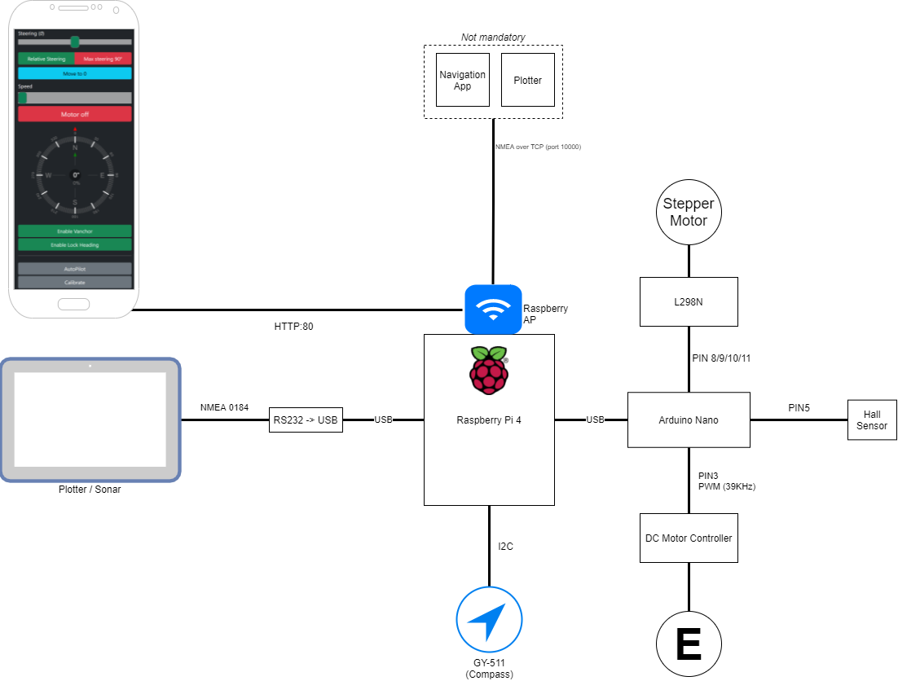

# Vanchor

Work in progress!

For controlling speed and direction of an electrical trolling motor.
The goal here is to be able to use (almost) any cheap trolling motor while still having autopilot/follow route features.

The current version gets it's coordinates from my Humminbird plotter. But it's easy to add support for cheap GPS modules if you want to. Just don't go too cheap.

You could also skip both of the GPS alternatives above as well as the compass and use an NMEA app on your phone to forward coordinates and heading to Vanchor, but I haven't tested the accuracy of that alternative.

Made a total makeover of the softwre to make it more event based, adding PID and so on. So there's probably a lot of bugs currently.

More pictures comming soon...

---

**Keep in mind that many aspects of this build can cause fires, chopped of fingers and/or other dangers.**

And I learned the hard way that it is a good idea to get a wrist-strap or something similar for your phone :)

---

## Current features:

- Web interface
  - Control of trolling motor
  - Configuration
- NMEA 0183 (TX/RX)
- NMEA through TCP (TX/RX)
  - Connect Navionics app, iNavX etc
- Supports ublox gps module (Tested on M9N)
- Virtual Anchor (Vanchor) based on position (NMEA RMC)
- Autopilot (NMEA APB sentence)
- Autopilot (GPX files)
- Lock heading (NMEA RMC sentence and/or e-compass)
- PID steering

## Hardware

There are a few alternatives when it comes to hardware, and since both the hardware and software used is pretty modular it's easy to modify.

### If you already have a plotter:

This was how i got started, I already had a Humminbird Helix SI G3 so I used the plotter as a location source (by sending NMEA to the rasperry). You may also need a propietary cable to connect to your plotters NMEA port.

- Raspberry Pi 4
- RS232 -> USB adapter
- 6-24V step-down module /w USB (https://www.amazon.se/dp/B09DPJXNTP)
- Arduino Nano (https://www.amazon.se/dp/B01MS7DUEM)
- GY-511 e-compass (https://www.amazon.se/dp/B07XXG8HNJ)
- 60A DC Motor Controller (https://www.amazon.se/gp/product/B075FTL53W/)
  - Note: I use a 60Amp controller on my 40Amp engine as a safety margin.
- L298N (for stepper) (https://www.amazon.se/gp/product/B077NY9RY6)
- Stepper Motor (https://www.amazon.se/gp/product/B072LVXVKW)
- A3144E Hall sensor (https://www.amazon.se/gp/product/B01M2WASFL)
- 5mm neodynium magnet (for hall sensor)
- Anti-corrosion spray for electronics (for protecting the electronics)
- Flex-PVC pipe for the power cables to the trolling motor.
- Silicon for waterproofing
- Various screws/bolts. See parts list [here.](./docs/drawing.pdf).

### If you want to use a GPS module:

Except for the list above you will also need a GPS module.
It's considerably cheaper ($50-$100) instead of buying a plotter.

Vanchor has been tested with the ublox Neo-M9N but it should work with many other Neo chips as well.

**Be aware of low accuracy GPS modules**

## Planned

- Some kind of simulation software
- Relying on a regular DC motor instead of a stepper for steering. And using a potentiometer for position-feedback.

## Details

### Web interface

Served from a flask server.
It's based on bootstrap4 and js (+jquery) and has a compass that visually shows the direction that you are heading, depth and so on.

The webinterface allows you to edit the config file and to update vanchor by uploading a ZIP so that you don't have to take your laptop with you to do changes.

### [Function] Vanchor

**V**irtual **Anchor** holds the boat in the current coordinates.
It uses a PID regulator to controll trolling motor speed in case of current or wind.

### [Function] Lock Heading

Lock heading can lock heading with and without GPS.

If GPS is available it will take current heading and set a destination point 1000km further away.
After that it starts to generate NMEA APB sentences with Cross-Track-Error that it follows.

This will counteract drifting to the sides due to wind or current.

If GPS is not available it will just take your current heading and try to keep that.

### [Function] Autopilot

Autopilot has 2 modes:

1. Receive APB sentence from NMEA.
2. Use APB sentence generated from GPX files

APB from GPX takes the coordinates of a GPX-file (with \<wp\> tags) and generates an NMEA APB-sentence with cross-track-error(XTE) / direction that it follows.

XTE magnitude is added to the feedback of the PID-controller.

## Configuring the raspberry (Without existing wifi/network on the boat)

1. Clone vanchor to /opt/vanchor
2. Run `/opt/vanchor/scripts/install.sh` to install packages and set it up as a systemctl service.
3. Run `sudo raspi-config` and enable I2C.
4. Connect the GY-511 to the raspberry GPIO-pins
5. Connect your RS232 adapter and Arduino and configure them to use a fixed name in /dev: https://www.freva.com/assign-fixed-usb-port-names-to-your-raspberry-pi/
6. Edit the device paths of Serial/Controller/Device and Serial/NmeaInput/Device to correspond to the fixed names of the arduino and RS232 adapter in the config.yml file.
7. Edit the var `APPASS="<PASSWORD>"` in `/opt/vanchor/scripts/wifi.sh` to a WIFI-password of your choice.
8. Run `/opt/vanchor/scripts/wifi.sh` to setup your raspberry as an access point. The raspberry will now reboot.
9. Run `journalctl -xef`
10. Connect the ssid named `Vanchor` with the password that you choose in step 6
11. Browse to http://10.0.0.1 and try it out while checking the logs from `journalctl -xef`

## Configuring the raspberry (with existing network + SignalK/Similar)

1. Clone vanchor to /opt/vanchor
2. Run `sudo raspi-config` and enable I2C.
3. Run `/opt/vanchor/scripts/install.sh` to install packages and set it up as a systemctl service.
4. Connect the GY-511 to the raspberry GPIO-pins assign-fixed-usb-port-names-to-your-raspberry-pi/
5. Connect your Arduino and configure them to use a fixed name in /dev: https://www.freva.com/assign-fixed-usb-port-names-to-your-raspberry-pi/
6. Edit the device path of Serial/Controller/Device to correspond to the fixed names of the arduino and RS232 adapter in the config.yml file.
7. Connect the raspberry to your boats network. A static IP or resolvable hostname is recommended.
8. Configure SignalK to forward NMEA data to port 10000 of the raspberry
9. Run `journalctl -xef`
10. Browse to http://\<ip\> and try it out while checking the logs from `journalctl -xef`

### Gearbox

The gearbox is 3D-printed in PLA and seems to hold up. [You can find the STL's in 3d/gearbox ](./3d/gearbox).

An exploded drawing is available [here.](./docs/drawing.pdf).

You mount an "hang-in"-style mount on the trolling motor that locks into place in the gearbox when the trolling motor is lowered.

#### What hardware you need:

| Pcs | Part                                                                     |
| --- | ------------------------------------------------------------------------ |
| 4   | 608ZZ bearing (Or similar bearing)                                       |
| 4   | 30mm M5 screws/bolts with a low profile head                             |
| 1   | 20mm bolt                                                                |
| 1   | A3144E sensor for calibrating                                            |
| 1   | ~5mm neodynium magnet  A3144E only reacts to 1 of the magnets poles. |
| 3   | ~10-20mm M3 screws                                                       |
| 4   | ~4-5mm self drilling screws                                              |
| -   | TP-cable for connecting the stepper and hall sensor                      |
| -   | CA-glue                                                                  |
| -   | Grease suitable for PLA                                                  |
| 1   | trolling motor with a 1" shaft                                           |

#### The parts you need to print

| Pcs | Part                                                                     | Comment                                                                                                                                                                       |
| --- | ------------------------------------------------------------------------ | ----------------------------------------------------------------------------------------------------------------------------------------------------------------------------- |
| 1   | [Trolling_Motor_Holder.stl](./3d/gearbox/TrollingMotorHolder-25.4mm.stl) | For 25.4mm/1in shaft diameter of the trolling motor. You might need to customize to make it fit your engine.  Though this size seems to be the most common one I've seen. |
| 4   | [BearingSpacer.stl](./3d/gearbox/BearingSpacer.stl)                      |                                                                                                                                                                               |
| 1   | [BoxHolder.stl](./3d/gearbox/BoxHolder.stl)                              |                                                                                                                                                                               |
| 1   | [CaseBottom.stl](./3d/gearbox/CaseBottom.stl)                            |                                                                                                                                                                               |
| 1   | [CaseTop.stl](./3d/gearbox/CaseTop.stl)                                  |                                                                                                                                                                               |
| 1   | [Gear1_12T.stl](./3d/gearbox/Gear1_12T.stl)                              |                                                                                                                                                                               |
| 2   | [Gear1_2_6T.stl](./3d/gearbox/Gear1_2_6T.stl)                            |                                                                                                                                                                               |
| 1   | [Gear2_18T.stl](./3d/gearbox/Gear2_18T.stl)                              |                                                                                                                                                                               |
| 1   | [Gear3_36T_Shaft.stl](./3d/gearbox/Gear3_36T_Shaft.stl)                  |                                                                                                                                                                               |
| 1   | [Gear3_36T.stl](./3d/gearbox/Gear3_36T.stl)                              |                                                                                                                                                                               |
| 1   | [JunctionBox.stl](./3d/gearbox/JunctionBox.stl)                          |                                                                                                                                                                               |
| 1   | [JunctionBoxLid.stl](./3d/gearbox/JunctionBoxLid.stl)                    |                                                                                                                                                                               |
| 1   | [StepperCover.stl](./3d/gearbox/StepperCover.stl)                        |                                                                                                                                                                               |
| 1   | [StepperGear_6T.stl](./3d/gearbox/StepperGear.stl)                       |                                                                                                                                                                               |

## Assembly of the gearbox:

- Assemble the parts according to the drawing and save the trolling motor holder for last.
- Disassemble the trolling motor and flip the transom mount so that the box holder can lock the gearbox into place (if possible)
- Take the gearbox and slide it over the trolling motor shaft
- Mount the trolling motor holder in the existing screw hole to mount it into place (or clean it off with IPA and use CA glue).

## Connecting the electronics

- Connect the motor controller to PIN3 of the arduino
- Connect signal from the hall sensor to PIN5
- Connect PIN8,9,10,11 to the L298N
- Connect the stepper motor to the output of L298N
- Connect the arduino to the raspberry with USB
- Connect the RS232 adapter to the raspberry
- Connect the GY-511 5v, GND, SCL, SCA to the corresponding GPIO-pins on the raspberry
