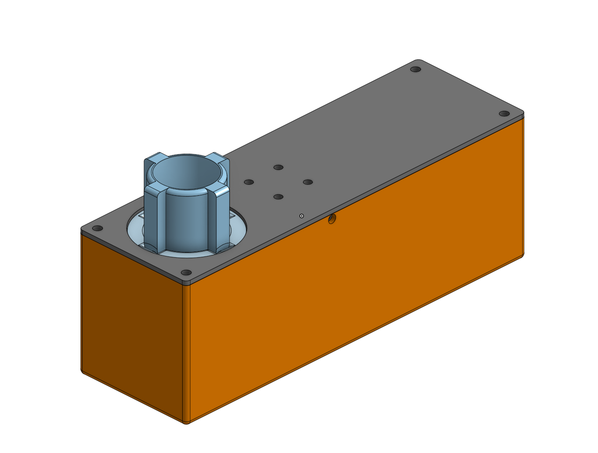
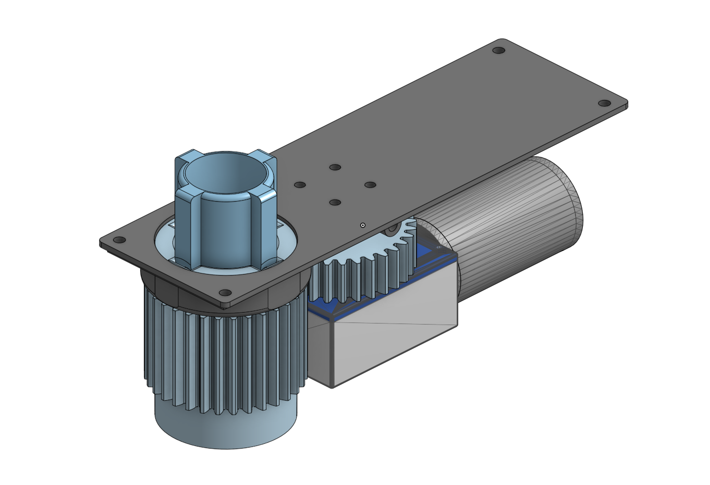
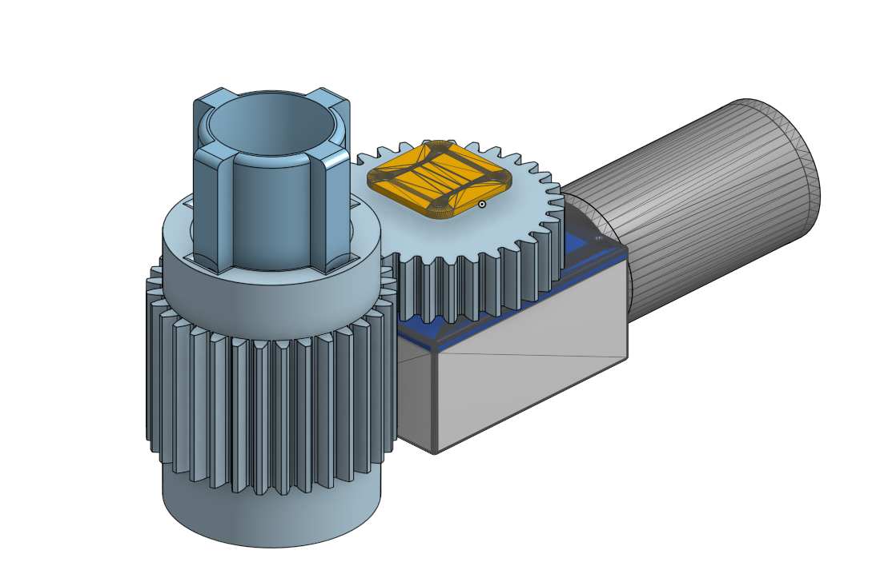
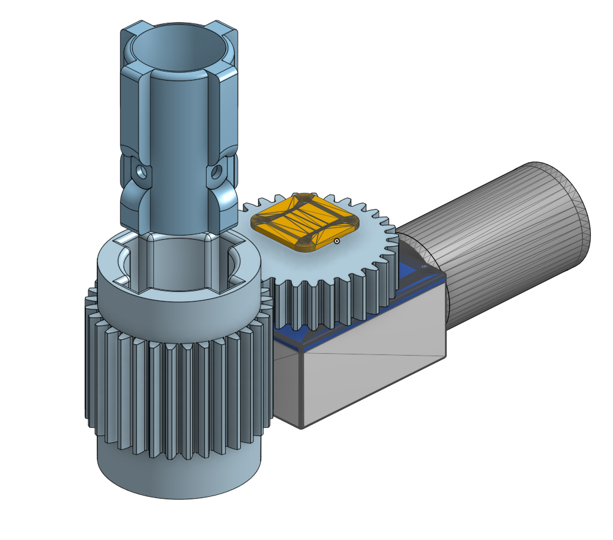

# Steering servo — worm-gear actuator

A **simple steering servo** for the trolling motor: a small DC gearmotor turns a
**worm**, the worm drives a **worm gear** on the steering output, and the output
**coupler** grips the trolling-motor shaft and swings it left/right. Using a worm
drive gives a big reduction in one stage and is **self-locking** — the output
can't back-drive the motor — so the boat holds a heading with the motor idle.

Steering angle is read by an **AS5600 magnetic rotary encoder**: a diametric
magnet sits on the output-shaft axis and the AS5600 breakout board mounts just
above it (see the pictures), reporting the absolute steering angle over I²C. That
is the feedback the firmware closes the steering loop on.

## Pictures

Different views of the assembly — some with the housing/top hidden or sectioned
for visibility. You can see the motor and its **worm** driving the **shaft
gear**, the **AS5600** board mounted just above the shaft-gear axis, and the
splined **output coupler** that grips the trolling-motor shaft.

| | |
|:---:|:---:|
|  |  |
|  |  |

## Parts (STL, in [`models/`](models/))

| File | Part |
|---|---|
| `Bottom.stl` | Housing body (holds the motor + gear train) |
| `Top.stl` | Top plate / mounting lid, with the output-shaft bore |
| `EngineGear.stl` | Worm that presses onto the motor shaft |
| `ShaftGear.stl` | Worm gear on the steering output (carries the encoder magnet) |
| `ShaftAdapter.stl` | Splined coupler that grips the trolling-motor shaft |

These are STL exports of the Fusion 360 `TrollingMotorServo` design — drop them
straight into a slicer to print. Print the gears and coupler in a tough,
outdoor-friendly material (PETG / ASA / nylon); PLA will creep and UV-degrade on
a boat.

## ⚠️ Not water-tight yet

This revision is **not sealed against water**. Before putting it on the water:

- **Conformal-coat the AS5600 chip** (and its board) so spray and condensation
  don't corrode or short it.
- **Waterproof the motor** — a marine/brushed motor with a sealed can, or pot the
  terminals and seal the shaft exit.
- Treat the housing joints and the output-shaft bore as splash paths — gasket or
  seal them, and give the enclosure a drain so water can't pool inside.

A properly sealed revision (shaft seal + gasketed lid + cable glands) is future
work; until then, keep it out of standing water and coat the electronics.
