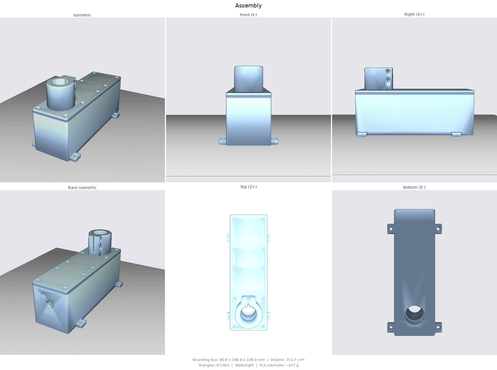
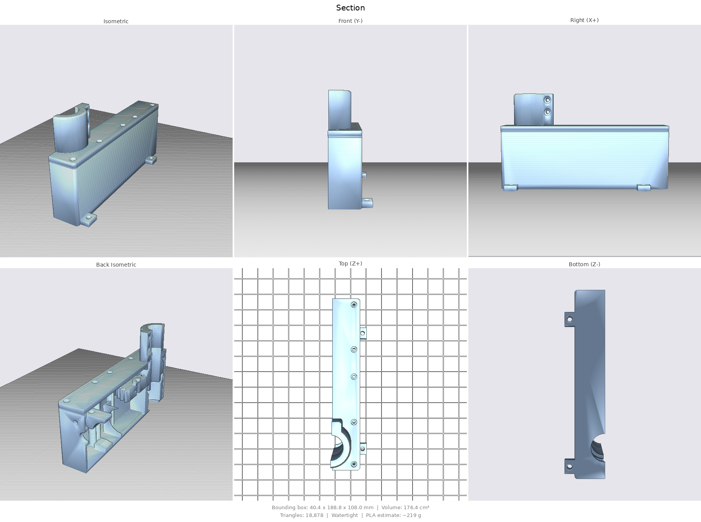
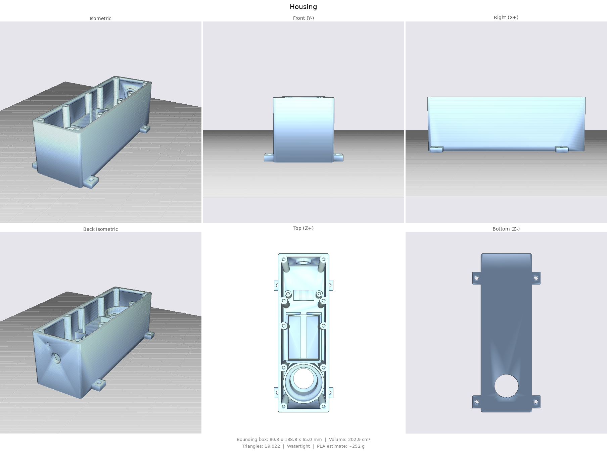
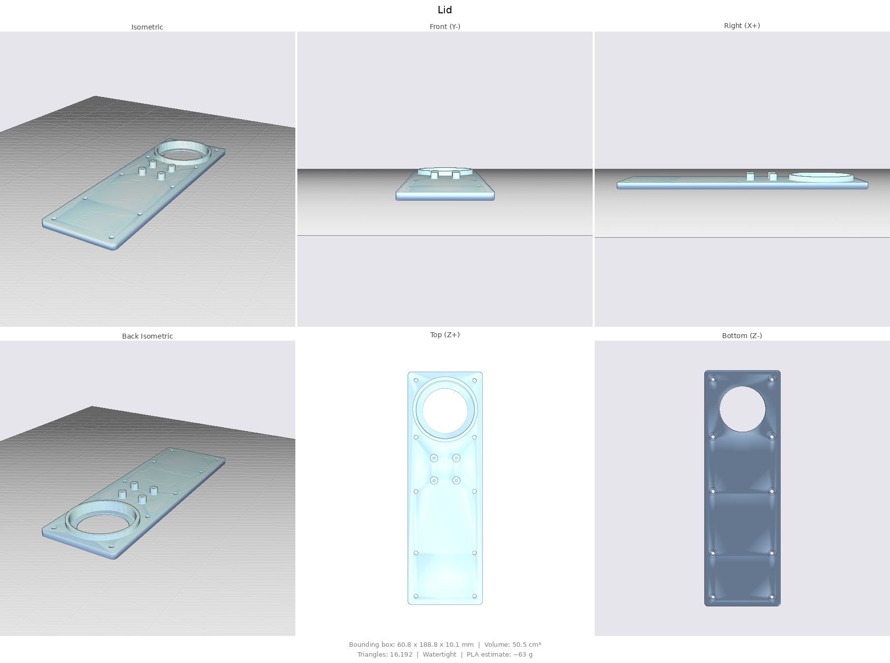
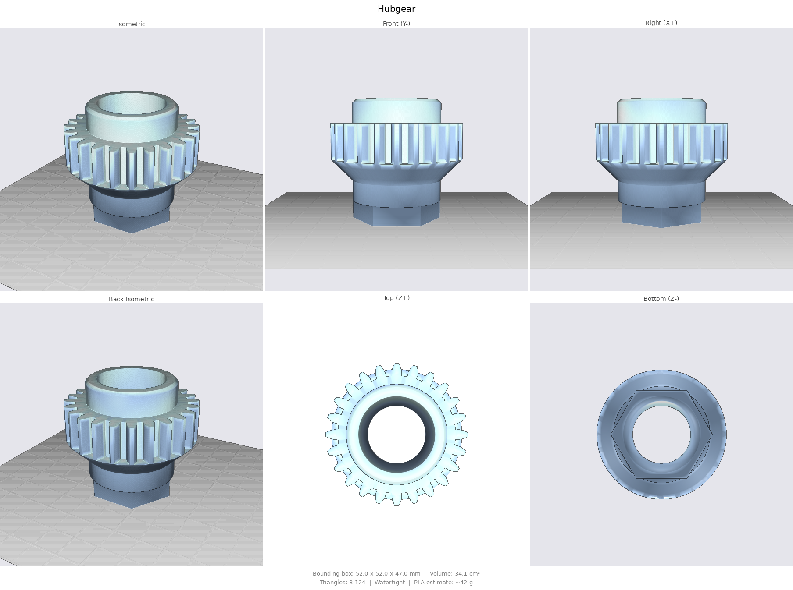
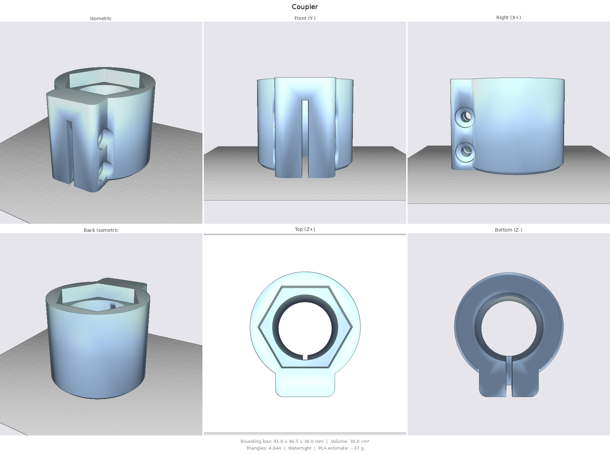

# Steering servo v2 — watertight worm-gear actuator (parametric)

An improved, **fully parametric** variant of the original steering servo in
[`../`](../README.md), regenerated from code instead of frozen Fusion 360
exports, and redesigned around the original's main weakness: **it was not
sealed against water**. Same concept — a self-locking worm gearmotor drives a
1:1 spur pair, the hollow output hub grips the trolling-motor shaft, and an
AS5600 absolute encoder reads the pinion axis (1:1 ⇒ true output angle) — but
every leak path of the first revision is closed by design.

Everything is generated by [`servo.py`](servo.py) (build123d). Outputs land in
[`out/`](out/) as STL (print-ready, already oriented) + STEP, renders in
[`renders/`](renders/).

```bash
.venv/bin/python cad/ai/servo.py
```

## Sealing strategy

| Leak path in v1 | Fix in this design |
|---|---|
| Open output bore through top plate | Output gear is one hollow **hub** with two smooth Ø35 seal lands running in standard **TC 35×47×7 rotary lip seals** — one pressed into the floor boss (lip down), one into the lid boss (lip up). The wet shaft passes through the hub bore and never enters the housing. |
| Open shaft hole in the floor | Floor pass-through + Ø37 labyrinth chamber sit *outside* the bottom seal. |
| Plain lid joint | Flat **TPU gasket** (2 mm, compresses to ~1.5) on a widened rim, clamped by 10 × M3. `GasketTPU.stl` also works as a cutting template for 2 mm neoprene sheet. |
| Motor + encoder screws through the lid | **No fastener penetrates the shell.** The motor sits in a printed nest and is held by a strap; the AS5600 hangs from bosses under the lid; all lid screws end in **blind** heat-set bosses. |
| Wire exit | Single **PG7 cable gland** in the motor-end wall for motor + I²C wiring. |
| Pressure cycling sucking water past the lips | Blind Ø5.5 vent pilot on the end wall — drill through and fit an M6 Gore-type breather if needed. |

Still do: conformal-coat the AS5600 board, and print the shell in ≥3 walls
(FDM walls are micro-porous; PETG/ASA + an interior brush of epoxy on the
floor/wall joints is cheap insurance for permanent immersion-adjacent duty).

**The weak point of any printed rotary seal is the land surface.** The Ø35
lands print vertically (fine layers help, 0.12 mm); finish them with 600-grit
+ grease, or wipe on thin epoxy/CA and polish back to Ø35.0 for a properly
smooth lip track.

## What else improved

- **Involute gears** (module 2, 24T/24T, 20° PA) replace the trapezoidal
  teeth — quieter, stronger, less backlash (centre distance carries a
  0.25 mm printed-gear allowance). Still 1:1 so firmware semantics are
  unchanged.
- **Support-free printing** for every part: the hub prints hex-down with a
  45° cone bridging gear OD → seal land; the lid prints top-face-down; the
  housing seal pocket has a 45° internal relief cone.
- **Coupler** is a proper split clamp: hex socket drives the hub, two M4
  pinch bolts in flanking lugs (captive nut pockets) grip the 25.4 mm shaft
  without marring set-screw dents.
- **Serviceable fasteners**: heat-set inserts everywhere, counterbored heads.
- **Boat-mount ears** (4 × Ø5.2) outside the sealed volume.
- Self-locking worm drive retained — the boat still holds heading unpowered,
  and STOP behaviour is unchanged.

## Motor

Sized for the **5840-31ZY-class worm gearmotor** (per the datasheet drawing):
gearbox 58.2 × 40 × 34 mm, motor can Ø31 × 57 mm, 8 mm D-shaft (7 mm across
the flat, matching the original STL's bore), 15 mm protrusion / 13 mm flat,
output axis 20 mm from the gearbox end. All of it is parameters in `P` if
your unit differs.

## Parts (out/)

| File | Part | Material / notes |
|---|---|---|
| `Housing.stl` | Sealed body: floor seal boss, motor nest + saddle, strap pillars, blind screw bosses, gland + vent bosses, mount ears | PETG/ASA, 3–4 walls, 30% gyroid, brim |
| `Lid.stl` | Lid: top seal boss, encoder bosses, 10 counterbored M3 | PETG/ASA, 3–4 walls |
| `HubGear.stl` | Output hub: gear + two seal lands + drive hex | PETG/nylon, 4 walls, ≥40%, 0.12–0.16 layers |
| `Pinion.stl` | Motor gear: D-bore, magnet pocket, M3 grub pilot | same as hub |
| `Coupler.stl` | Hex-socket split clamp for the 25.4 mm shaft | PETG/ASA, 4 walls, 40% |
| `Strap.stl` | Motor-can hold-down | PETG |
| `GasketTPU.stl` | Lid gasket | TPU 95A, 100% infill |
| `Assembly.stl` / `Section.stl` | Visual reference only | — |

Print settings baseline: 0.2 mm layer (0.12–0.16 for the gears), no supports
anywhere, PETG minimum — no PLA on a boat.

## Bill of materials

- 2 × rotary shaft seal **TC 35×47×7** (NBR; stainless-spring/FKM if you can)
- 1 × **PG7 cable gland** + locknut
- 12 × M3 heat-set insert (Ø4.6 × 5.7), 10 × M3×12 (lid), 2 × M3×12 (strap)
- 2 × M4×20 + M4 nuts (coupler clamp)
- 2 × M2×6 self-tappers (AS5600 board), 1 × Ø6×2.5 diametric magnet
- 5840-31ZY worm gearmotor (12 V), AS5600 breakout
- Marine grease, optional M6 Gore-type breather, optional epoxy for the lands

## Assembly

1. Press heat-set inserts into the 10 lid bosses and 2 strap pillars.
2. Press the bottom seal into the floor boss, **lip down**, greased.
3. Grease the hub's lower land and drop the hub in — it seats on the boss rim.
4. Press the pinion onto the motor D-shaft (grub pilot over the flat, magnet
   pocket up), glue the magnet in, lower the motor into its nest meshing the
   gears, fit the strap over the can (a strip of TPU/foam under the strap
   damps vibration).
5. Wire motor + AS5600 through the PG7 gland; screw the AS5600 board
   chip-down to the lid bosses.
6. Press the top seal into the lid boss, **lip up**, greased. Lay the gasket
   on the rim, lower the lid over the hub's upper land, torque the 10 screws
   evenly (snug + ¼ turn — TPU should compress ~0.5 mm).
7. Slide the coupler's hex socket onto the hub hex, slide the assembly onto
   the trolling-motor shaft, tighten the two M4 pinch bolts.

## Key parameters (`P` in servo.py)

| Parameter | Value | Meaning |
|---|---|---|
| `shaft_d` | 25.4 | trolling-motor shaft |
| `module` / `teeth` | 2.0 / 24 | both gears, OD 52, CD 48.25 |
| `seal_land_d` / `seal_od` / `seal_h` | 35 / 47 / 7 | TC 35×47×7 seals |
| `mot_*` | 5840-31ZY | full motor envelope, shaft, nest fit |
| `wall` / `floor_t` / `lid_t` | 2.4 / 3 / 5 | shell |
| `gasket_t` / `gasket_squeeze` | 2.0 / 0.5 | lid gasket |
| `enc_hole_pitch` | 18 | AS5600 board holes — **measure your board** |

Overall: 80.8 × 188.8 × ~73 mm plus coupler; ~470 g of filament total.

## Renders

| | |
|:---:|:---:|
|  |  |
|  |  |
|  |  |
