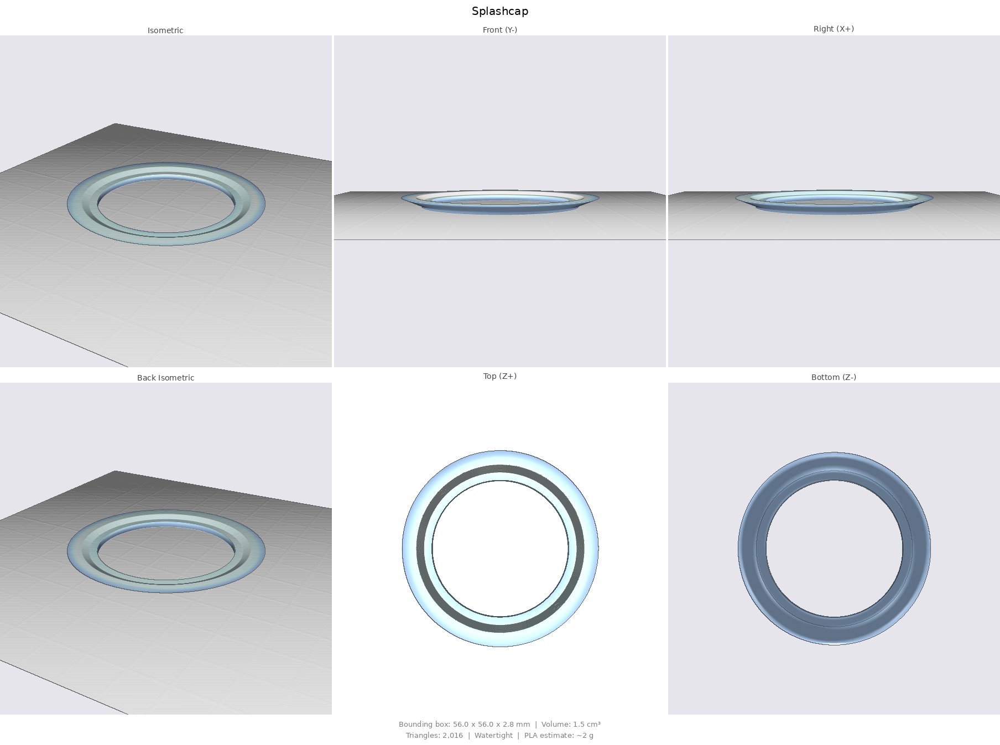

# Steering servo v3 — robust 2:1 watertight actuator with hall-indexed absolute feedback

Clean-sheet redesign (successor to [`../ai/`](../ai/README.md)) optimised for
**robustness and torque**, printed **PETG-first**, sealed like v2. Built for
the 5840-31ZY worm gearmotor, AS5600 encoder, 25.4 mm trolling-motor shaft,
and transom-mount installation. Fully parametric: [`servo.py`](servo.py)
(build123d) regenerates everything in [`out/`](out/) (STL print-oriented +
STEP), renders in [`renders/`](renders/).

```bash
.venv/bin/python cad/ai2/servo.py
```

## The trick: 2:1 torque *and* full-360° absolute, no third gear

A reduction normally breaks single-turn absolute sensing (the encoder gear no
longer maps 1:1 to the output), and fixing that with a dedicated 1:1 sense
gear costs a gear as big as the ring itself. Instead:

- **Drive**: pinion z16 → ring z32 (module 2, PA 22.5°, 16 mm face).
  2:1 → **~2× motor torque** at the output (~4.7 N·m at stall) and half the
  motor load; tooth stress at stall ≈ 13 MPa — comfortable for PETG.
- **AS5600** stays on the pinion: it turns twice per output rev, so it reads
  the azimuth at **double resolution** (0.044°) but with a 180° ambiguity.
- **Hall index resolves the ambiguity**: a Ø4×2 magnet sits in the ring
  gear's underside web (r 26.5) and a TO-92 hall switch (A3144 / DRV5033
  class) in a ribbed floor tower passes 1.2 mm under it — **one pulse per
  output revolution** at a fixed, repeatable azimuth.

Firmware contract:

```
azimuth = as5600_angle / 2 + k * 180°          (k ∈ {0, 1})
```

- At the index pulse, azimuth ≡ calibrated `index_offset` → sets/validates
  `k` and re-zeros drift. Store `k` + last angle in NVS across power cycles.
- Cold start with no valid NVS: slew slowly until the index fires (≤ one
  output rev), then everything is absolute again.
- Every subsequent crossing is a free self-check: if the implied `k` ever
  disagrees, something slipped — flag it. This is also the easy AS5600
  zeroing the hall was asked for: physical zero is wherever the magnet sits,
  independent of how the gears meshed at assembly.

## Sealing (carried over from v2, unchanged in principle)

Hollow output hub with two smooth Ø35 lands running in **TC 35×47×7** lip
seals (floor boss + lid boss); the wet shaft passes through the hub bore and
never enters the housing. Flat **TPU gasket** into **blind** heat-set bosses
(11 × M3 — no fastener channel reaches the interior), motor held by nest +
strap (zero shell penetrations), single **PG7 gland**, and two blind pilots
on the end wall: **vent** (right) and **grease** (left) — drill through and
fit an M6 breather / grease screw only if you want them. New in v3: a
press-on **splash cap** umbrella on the coupler shields the lid bore gap
from direct spray.

FDM notes (PETG): ≥4 walls on the shell, seal lands smoothed (600 grit +
grease, or thin epoxy wipe polished back to Ø35.0), brush epoxy on interior
floor/wall joints if it will sit in spray all season.

## Robust shell

3 mm walls, 4 mm floor, 7.5 mm lid, Ø10 screw bosses, beefed strap, and
**full-length 8 mm transom-mount flanges** on both sides with slotted holes
(6.5 × 12 — M6 hardware, slots forgive bracket tolerances; positions
parametric via `flange_slot_ys`).

## Parts (out/)

| File | Part | Print |
|---|---|---|
| `Housing.stl` | Body: seal boss, hall tower, motor nest, blind bosses, gland, flanges | PETG 4 walls, 30% gyroid, 0.2 mm, brim |
| `Lid.stl` | Lid: seal boss, AS5600 bosses, 11 c'bored M3 | PETG 4 walls |
| `HubGear.stl` | Output hub: ring z32 + seal lands + hex + index-magnet pocket | PETG 4–5 walls, ≥50%, 0.12–0.16 mm |
| `Pinion.stl` | z16 pinion: D-bore, AS5600 magnet pocket, grub pilot | same |
| `Coupler.stl` | Hex-socket split clamp, cap groove | PETG 4 walls, 40% |
| `SplashCap.stl` | Spray umbrella, snaps into the coupler groove | PETG or TPU, 100% |
| `Strap.stl` | Motor-can hold-down | PETG |
| `GasketTPU.stl` | Lid gasket (or neoprene template) | TPU 95A, 100% |

All STLs are already print-oriented; nothing needs supports.

## Bill of materials

- 2× rotary shaft seal **TC 35×47×7** NBR (FKM/stainless spring if possible)
- 1× **PG7 cable gland** + locknut
- 13× M3 heat-set insert; 11× M3×14 (lid), 2× M3×12 (strap)
- 2× M4×20 + nuts (coupler); 2× M2×6 self-tap (AS5600)
- 1× Ø6×2.5 **diametric** magnet (AS5600, pinion boss)
- 1× Ø4×2 **axial** magnet (index, ring web) + 1× hall switch **A3144 /
  DRV5033** (TO-92)
- 5840-31ZY worm gearmotor 12 V (pick RPM for desired steering rate — 2:1
  halves it: 30 rpm motor → 15 rpm ≈ 90°/s at the shaft), AS5600 breakout
- Marine grease; optional M6 breather + M6 grease screw; epoxy for lands

## Assembly

1. Inserts into all bosses. Press the hall sensor into its tower pocket
   (face up, dab of epoxy), leads along the floor to the gland end.
2. Bottom seal into the floor boss, lip down, greased.
3. Glue the Ø4×2 magnet into the ring's underside pocket, then drop the hub
   in (lower land through the seal; it seats on the boss rim).
4. Pinion onto the motor D-shaft (grub over the flat, magnet pocket up,
   Ø6×2.5 diametric magnet glued). Motor into the nest, strap over the can.
5. Wire motor + hall + AS5600 out through the PG7. AS5600 chip-down onto the
   lid bosses.
6. Top seal into the lid boss (lip up, greased), gasket on the rim, lid down
   over the upper land, 11 screws snug + ¼ turn.
7. Splash cap over the coupler base groove (from the hex end), coupler onto
   the hub hex, onto the shaft, two M4 pinch bolts.
8. Calibrate: steer to boat-centre, record AS5600; slew through the index
   pulse once and store the offset. Done — absolute forever after.

## Key parameters (`P` in servo.py)

| Parameter | Value | Meaning |
|---|---|---|
| `teeth_p` / `teeth_r` / `module` | 16 / 32 / 2.0 | 2:1, ring OD 68, CD 48.25 |
| `pressure_angle` / `gear_t` | 22.5° / 16 | no undercut, wide face |
| `seal_land_d` | 35 | TC 35×47×7 seals |
| `idx_r` / `idx_gap` | 26.5 / 1.2 | index magnet orbit / sensor gap |
| `wall` / `floor_t` / `lid_t` | 3 / 4 / 7.5 | robust shell |
| `flange_slot_ys` | (0, 110) | transom slot positions |
| `enc_hole_pitch` | 18 | AS5600 board holes — **measure yours** |

Envelope: 107 × 199 × 78.5 mm over the flanges (+ coupler stack above);
~750 g printed.

## Renders

| | |
|:---:|:---:|
|  |  |
|  |  |
|  |  |
