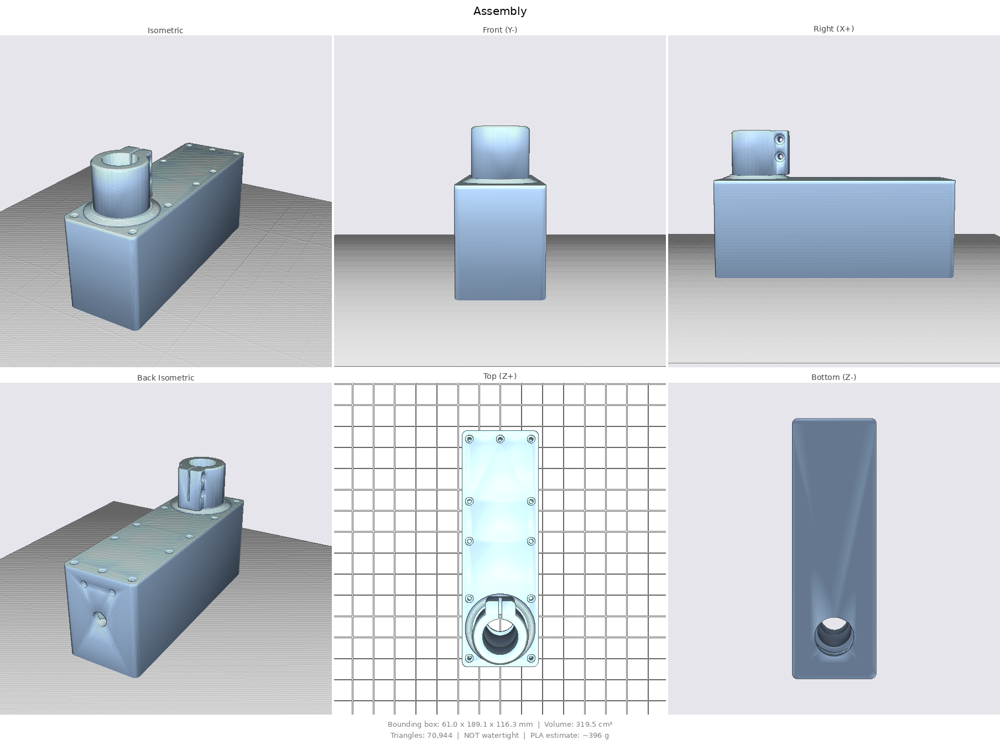
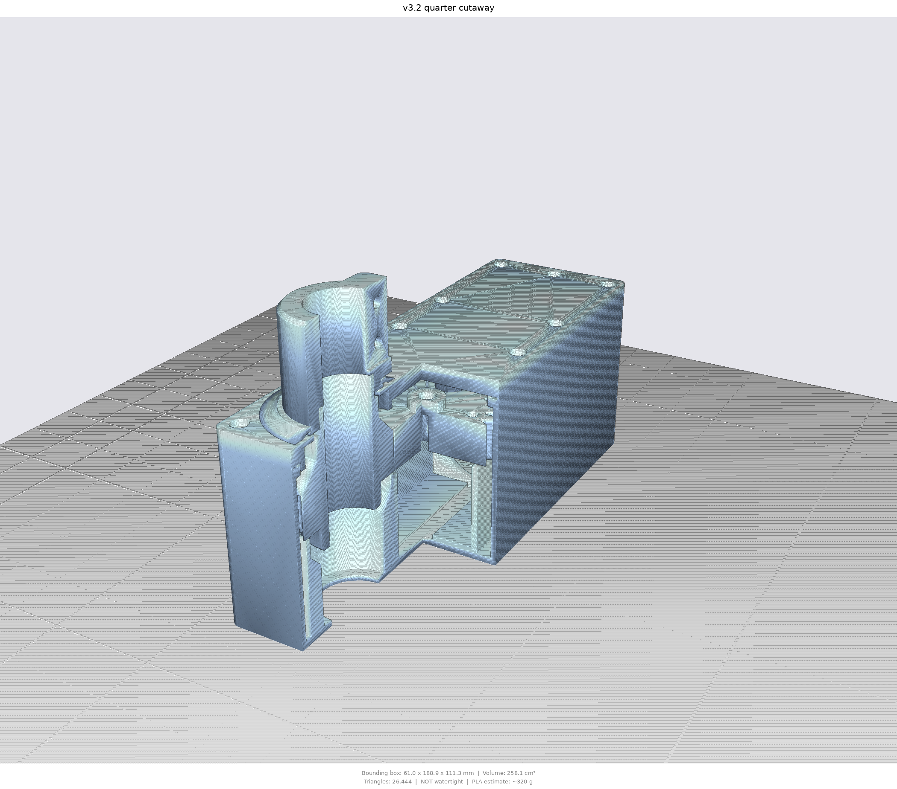
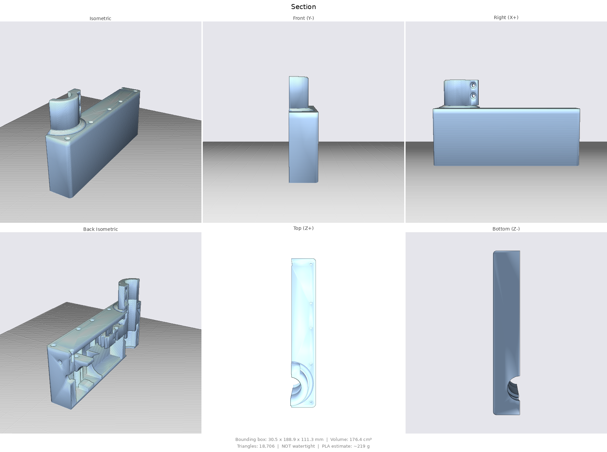
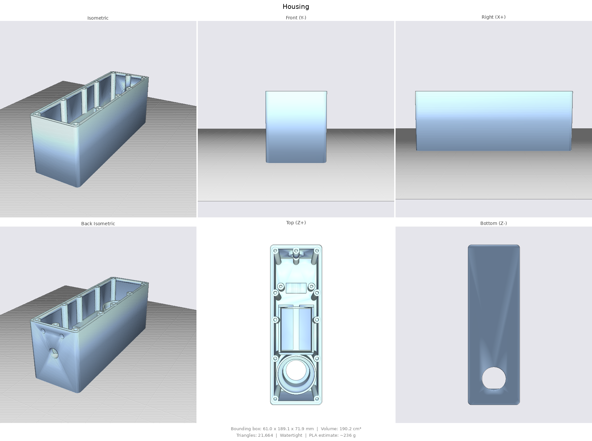
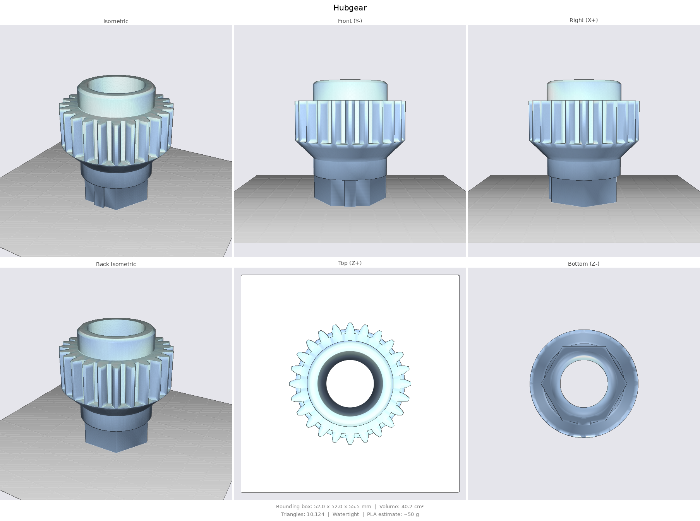
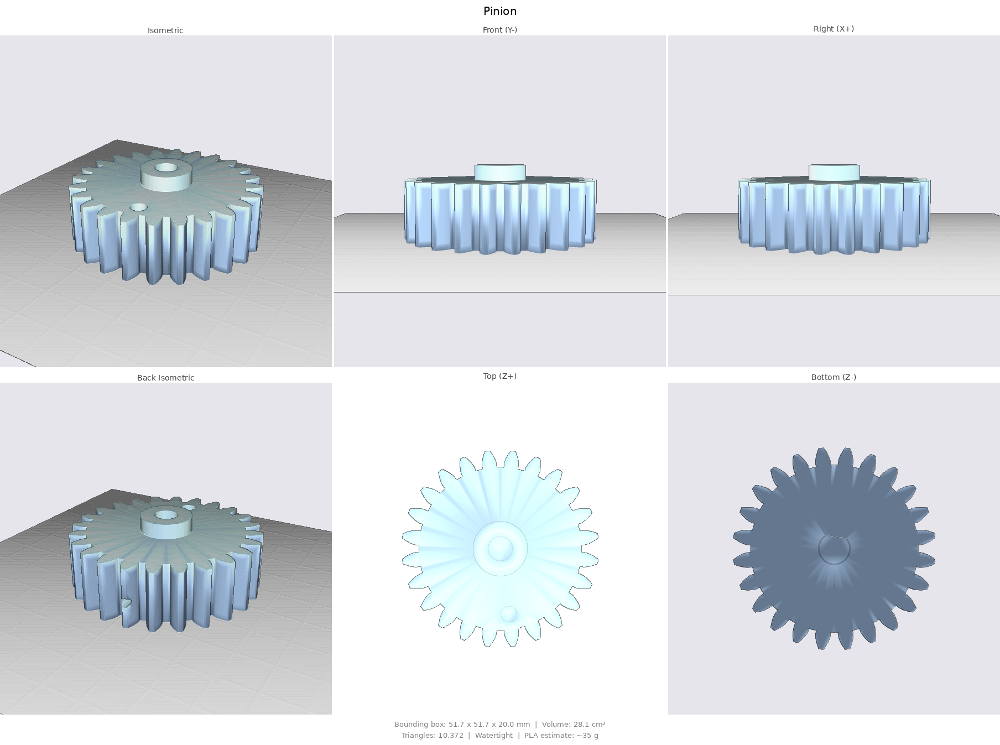

# Steering servo v3 — watertight 1:1 actuator with hall-indexed absolute feedback

Clean-sheet redesign (successor to [`../ai/`](../ai/README.md)) around the
**5840-31ZY worm gearmotor (20 rpm high-torque variant)**, AS5600 encoder,
25.4 mm trolling-motor shaft, and the user's transom-mount installation.
PETG-first, plastic-optimised. Fully parametric: [`servo.py`](servo.py)
(build123d) regenerates everything in [`out/`](out/) (STL print-oriented +
STEP), renders in [`renders/`](renders/).

```bash
.venv/bin/python cad/ai2/servo.py
```

## Drive: 1:1, and why not a reduction

The 20 rpm 5840 variant already delivers several times the torque steering
needs (the family is rated up to ~100 kg·cm at low speed). A reduction would
only halve steering speed and, counterintuitively, make the printed gears
*weaker*: tooth force = motor torque / pinion radius, so a smaller reduction
pinion concentrates more force per tooth. At 1:1 (z24/z24, module 2,
PA 22.5°, 16 mm face) the shaft steers at **120°/s** and stall tooth stress
stays ~35 MPa — the gears remain the designed fuse against a hard jam.

## Feedback: AS5600 + hall index

- **AS5600** on the pinion axis reads output azimuth directly (1:1,
  absolute, full 360° continuous): `azimuth = as5600 + stored_offset`.
- **Hall index**: a Ø4×2 magnet in the pinion's top face passes 1.2 mm under
  a TO-92 hall switch (A3144 / DRV5033 class) in a lid boss — one pulse per
  revolution at a fixed physical azimuth. That's the easy zeroing: calibrate
  `stored_offset` once at the pulse, re-validate at every crossing, and
  re-zero automatically after any reassembly or slip. At 1:1 the pinion
  magnet is exactly in phase with the output.

### Alignment chain (the stored zero survives reassembly)

- **Hub ↔ coupler is keyed**: a 5×1.6 mm rib on one hex flat + matching
  keyway in the socket — the coupler fits in exactly ONE of the six hex
  orientations (verified: all five wrong positions physically block). The
  key stays inside the hex corner radius, so the seal-passage envelope is
  unchanged.
- **Gear mesh witness rule**: if you ever separate the gears, re-mesh with
  the hub's key rib and the pinion's index-magnet pocket facing each other
  along the gear centre line (they're both visible from above). That pins
  the mesh phase, which otherwise shifts the index azimuth in 15° tooth
  steps.
- **Coupler ↔ shaft** is a friction clamp (continuous): when re-clamping,
  point the trolling motor straight forward first — then the stored offset
  is still exact. And if anything slips anyway, one pass through the index
  pulse re-zeros in firmware.

## Sealing

- Two **TC 35×47×7** rotary lip seals on the hollow hub's Ø35 lands (floor
  boss + lid boss); the wet shaft passes through the hub bore and never
  enters the housing.
- **Form-in-place silicone gasket**: a shallow retention channel
  (2.4 × 0.8 mm) runs around the rim, outboard of every screw hole. Lay a
  ~3 mm bead of **neutral-cure** silicone in it, set the lid on, snug the 11
  screws, let cure. Conforms to layer texture better than a printed TPU
  gasket, needs little clamp force, and every service gets a fresh seal.
  (Neutral/oxime cure — acetic-cure vinegar-smell silicone corrodes
  electronics in a closed box.)
- Blind heat-set bosses (no fastener channel reaches the interior), motor
  held by nest + strap (zero shell penetrations), single **PG7 gland**,
  blind **vent** + **grease** pilots on the end wall (drill to activate),
  press-on **splash cap** umbrella over the lid bore.
- **Wall porosity is handled by coating, not plastic**: walls are 2 mm —
  epoxy/paint the shell (inside floor joints and/or outside) after printing.
  Seal lands: 600 grit + grease, or thin epoxy wipe polished to Ø35.0.

## Plastic budget

Shell gauge follows the original cad/ design (2 mm walls, 2.8 mm floor) —
rigidity comes from the box shape and the motor clamped inside it. The lid is
a 3 mm plate: the rim sits level with the top of the seal pocket, so the
pocket lives wholly in the lid's hanging boss instead of thickening the
whole plate. The floor seal boss is a thin-wall tower (2.4 mm around the
labyrinth, 45° flare, four gussets) — the full ring exists only at the
seal pocket. No mount flanges: the
transom mount retains the housing. Total printed volume ~320 cm³ solid
(≈45% less than the earlier robust draft before infill savings).

## Parts (out/)

| File | Part |
|---|---|
| `Housing.stl` | Body: floor seal boss tower, motor nest, blind bosses, gland, silicone channel |
| `Lid.stl` | Lid: seal boss, AS5600 bosses, hall pocket, 11 c'bored M3 |
| `HubGear.stl` | Output hub: z24 gear + seal lands + drive hex |
| `Pinion.stl` | z24 pinion: D-bore, AS5600 + index magnet pockets, grub pilot |
| `Coupler.stl` | Hex-socket split clamp, splash-cap groove |
| `SplashCap.stl` | Spray umbrella, snaps into the coupler groove |
| `Strap.stl` | Motor-can hold-down |
| `TestFit.stl` | **Print first**: fit coupons — seal pocket, land+hex (slide a real seal over it), hex socket, D-bore, magnet pockets, insert hole, M4 nut pocket |

Print settings per part are in the table below.

All STLs print-oriented, no supports. `Assembly/Section/Cutaway.stl` are
visual references only.

## Print settings (PETG, 0.4 mm nozzle)

Common to everything: dry PETG, ~240 °C / 80 °C bed, fan 30–50 %, **no
supports anywhere** (all STLs are pre-oriented), elephant-foot compensation
~0.15 mm on (or lightly deburr bores after printing). Where a range is
given, the first value is the recommendation.

| Part | Layer | Walls | Infill | Top/bottom | Notes |
|---|---|---|---|---|---|
| `Housing` | 0.20 | 3 | 20 % gyroid | 5 / 4 | 5 mm brim (tall thin box). Walls are 2 mm ⇒ effectively solid from perimeters; infill only fills the boss tower and gussets. Slow the top layers for a clean gasket rim + channel. |
| `Lid` | 0.20 | 3 | 25 % gyroid | 5 / 5 | Prints top-face-down: first layer is the visible outside — clean bed. Plate is 3 mm ⇒ mostly skin anyway. |
| `HubGear` | **0.12–0.16** | 4–5 | 50 % gyroid/cubic | 5 / 5 | The precision part. Fine layers for tooth profile + seal-land finish; outer perimeter slow (~30 mm/s). Seam: *aligned* (one line to sand off the Ø35 lands), not random. |
| `Pinion` | **0.12–0.16** | 4 | 50 % gyroid/cubic | 5 / 5 | Same as hub. D-bore is a press fit — don't over-extrude first layers. |
| `Coupler` | 0.20 | 4 | 40 % gyroid | 5 / 5 | Clamp flexes at the slit: PETG only, no brittle blends. Nut pockets bridge fine. |
| `SplashCap` | 0.20 | 2 | 100 % | — | Tiny; solid. Slight flex needed to snap over the groove. |
| `Strap` | 0.20 | 3 | 30 % | 4 / 4 | Nothing critical. |
| `TestFit` | match target | match | 20 % | 4 / 4 | Use the **same layer height, walls, flow and material** as the part each coupon stands in for — that's what makes the fit test meaningful. Infill doesn't matter. |

Why these: dimensional fits are set by perimeters/flow (hence matching
TestFit to the real settings), gear strength is set by walls + infill at
the tooth roots (hence 4–5 walls on the gears, not just infill), and the
sealing surfaces (gasket rim, seal lands, lid faces) want slow, consistent
skins rather than more plastic.

## Bill of materials

- 2× rotary shaft seal **TC 35×47×7** NBR
- 1× **PG7 cable gland** + locknut; neutral-cure silicone (gasket + gland
  back-fill)
- 13× M3 heat-set insert; 11× M3×10 (lid), 2× M3×12 (strap)
- 2× M4×20 + nuts (coupler); 2× M2×6 self-tap (AS5600)
- 1× Ø6×2.5 **diametric** magnet (AS5600), 1× Ø4×2 **axial** magnet (index),
  1× hall switch **A3144 / DRV5033** (TO-92)
- 5840-31ZY 12 V 20 rpm, AS5600 breakout, marine grease, epoxy/paint for the
  shell coat

## Assembly

1. Inserts into all bosses. Hall sensor into the lid pocket (face down, dab
   of epoxy), leads with the AS5600 harness.
2. Bottom seal into the floor boss, lip down, greased.
3. Hub in (lower land through the seal; seats on the boss rim).
4. Pinion onto the D-shaft: grub over the flat, Ø6×2.5 diametric magnet in
   the centre boss, Ø4×2 index magnet flush in the top-face pocket. Motor
   into the nest, strap on.
5. Wire motor + hall + AS5600 through the PG7. AS5600 chip-down on the lid
   bosses.
6. Top seal into the lid boss (lip up, greased). Silicone bead in the rim
   channel, lid on, 11 screws snug. Let cure before submersion.
7. Splash cap onto the coupler groove (from the hex end), coupler onto the
   hub hex and the shaft, two M4 pinch bolts.
8. Calibrate once: steer to boat-centre, note AS5600; pass the index pulse
   and store the offset.

Before any of this: **print `TestFit.stl`** and check every fit against the
real hardware (seal press, lip-over-hex slide, hex pair, motor shaft,
magnets, insert, nut). Tune the `P` tolerances and reprint the coupons
until they fit — they cost minutes; the housing costs a day.

## Key parameters (`P` in servo.py)

| Parameter | Value | Meaning |
|---|---|---|
| `teeth_p` / `teeth_r` / `module` | 24 / 24 / 2.0 | 1:1, both gears OD 52, CD 48.25 |
| `pressure_angle` / `gear_t` | 22.5° / 16 | stubby strong teeth |
| `seal_land_d` | 35 | TC 35×47×7 seals |
| `idx_r` / `idx_gap` | 17.5 / 1.2 | index magnet orbit / sensor gap |
| `key_w` / `key_h` / `key_fit` | 5 / 1.6 / 0.5 | hex orientation key |
| `wall` / `floor_t` / `lid_t` | 2 / 2.8 / 3.0 | original-gauge shell |
| `groove_w` / `groove_d` | 2.4 / 0.8 | silicone retention channel |
| `enc_hole_pitch` | 18 | AS5600 board holes — **measure yours** |

Envelope: 61 × 189 × 77 mm (+ coupler stack above the lid).

## Renders

| | |
|:---:|:---:|
|  |  |
|  |  |
|  |  |
