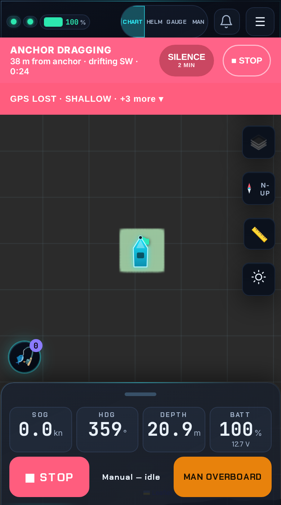
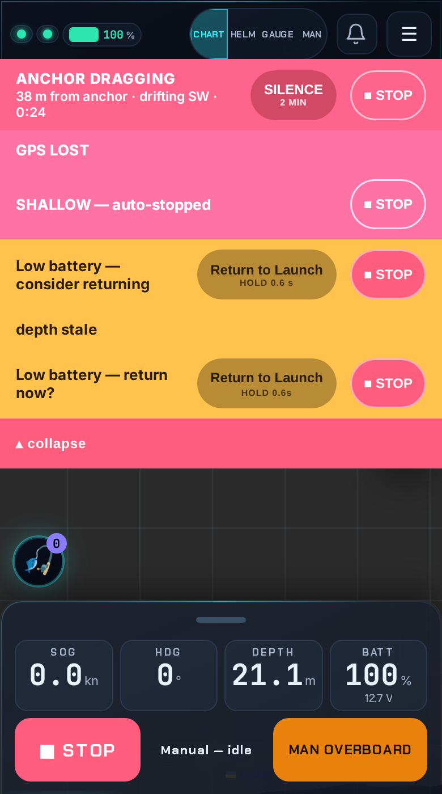

# Alert-banner presentation — compact, prioritized stack (#166)

**Status: decided + implemented** (this document is the design record for the
`feat/alert-stack` PR).

## Problem

When several alerts fire together (battery low + shallow + heading stale +
link blip + device fault is an easy afternoon on a boat), the safety strips in
`#safety-banners` stack vertically and eat the phone screen. The z-order /
CSS-`order` priority list coordinates *who is on top*, but nothing coordinates
*space*: six active banners = six full-height rows over the chart and controls.

Requirements from the issue:

1. **Safety floor** — MOB / drag / fix-lost / shallow-stop (and by extension
   no-go, link-failsafe, controller-fault, battery-critical) must never be
   invisible while active.
2. **Compact gracefully** — one slot + "+N more", collapsed strip, or grouped
   rotation; proposals welcome.
3. **Glanceable in sunlight, one-hand reach** — big text, color = severity,
   thumb-reachable affordances (44 px targets, wet fingers).
4. **Alert history dialog stays the full record** (already exists, `alerts.js`).

## Inventory — every banner source (from code, current `main`)

### Inside `#safety-banners` (the compaction scope), by CSS `order` (0 = top)

| order | id | style | trigger (telemetry) | owner | actions on strip |
|---|---|---|---|---|---|
| 0 | `health-fault-banner` | alarm | `health.controller_fault != null` | health.js (dynamic) | — |
| 1 | `mob-banner` | mob | `mob.active` | safety.js | Clear, STOP |
| 2 | `anchor-alarm-banner` | alarm | `anchor_alarm.firing` OR `safety.drag_alarm` | safety.js | RECOVER (hold), SILENCE, STOP |
| 3 | `health-fix-lost-banner` | alarm | `health.fix_lost` (+ GPS detail) | health.js (dynamic) | — |
| 4 | `shallow-banner` | alarm | `safety.shallow_stop` \|\| `safety.nogo_stop` | safety.js | STOP |
| 5 | `health-hdg-stale-banner` | alarm | `health.heading_stale` | health.js (dynamic) | — |
| 6 | `batt-crit-banner` | batt-crit | battery SOC ≤ crit threshold | safety.js | RTL (hold), STOP |
| 7 | `batt-warn-banner` | batt-warn | battery SOC ≤ warn threshold | safety.js | RTL (hold), STOP |
| 8 | `link-banner` | alarm | `link.failsafe_engaged` | safety.js | STOP |
| 9 | `health-depth-stale-banner` | warn | `health.depth_stale` | health.js (dynamic) | — |
| 10 | `rtl-banner` | warn | `rtl_recommended` (suppressed while a batt strip is up) | safety.js | RTL (hold), STOP |
| 11 | `auto-apb-banner` | warn | auto Follow-APB engaged | safety.js | Disengage |
| 12 | `gov-banner` | warn | sustained governor intervention (dwell-gated) | safety.js | STOP |

Safety-floor members (alarm-class): orders 0–6 and 8. Everything else is
warn-class advisory.

### Outside the container — deliberately NOT in scope

| element | owner | why untouched |
|---|---|---|
| `#critical-stop-banner` (z 100000) | core.js | STOP-not-confirmed; must beat everything, styled inline to survive stale CSS |
| `#stale-data-banner` (z 2900) | core.js | link watchdog; already sits *below* `#safety-banners` by design |
| `#arm-banner` | armbar.js | armed-state status strip, not an alert |
| `#nav-paused-banner`, `#rm-paused-banner`, `#rm-mob-banner` | route/remote views | view-scoped duplicates inside their own panels |
| alerts bell + dialog | alerts.js | the full record; unchanged (req 4) |

## Proposals considered

### A — Top-slot + labeled overflow strip  ← **CHOSEN**

- **0 or 1 active banner: pixel-identical to today.** Full strip, inline
  actions, no new chrome.
- **≥ 2 active:** the highest-priority active banner keeps its full-size strip
  (text + its action buttons, unchanged element). Every other active banner
  collapses into **one slim overflow strip** directly beneath it:
  `▲ GPS LOST · SHALLOW · +2 more ▾` — short labels for each collapsed
  *alarm-class* alert in priority order (never elided), warn-class alerts
  fold into the `+N` count. The strip is colored by the worst collapsed
  severity (red if any collapsed alarm, amber otherwise) and is a single
  full-width ≥44 px tap target.
- **Tap the strip → expand** to today's full stack (so every action button is
  one tap away); tap the collapse bar or wait 10 s of no interaction →
  recollapse. A new alert re-runs priority normally: if it outranks the
  current top it takes the slot immediately.
- Max vertical cost is **2 rows** (one full banner + one slim strip) no matter
  how many alerts fire, vs. N rows today.

Requirement check: (1) top safety alert always full-size, every other active
alarm keeps a visible red label token at all times — nothing safety-critical
is ever represented by only a number; (2) graceful: nothing changes until two
alerts overlap; (3) big text + severity color preserved; one thumb tap to
expand; (4) history untouched.

### B — Always-collapsed severity strip — rejected

Everything, including a lone alert, renders as a slim strip that expands on
tap. Rejected because the *common* case (exactly one alert) loses
glance-ability and zero-tap actions: "ANCHOR DRAGGING · 38 m · drifting SW"
with its hold-to-RECOVER button must be readable and actionable without any
interaction, in sunlight, immediately. Compacting the single-alert case
solves a problem that doesn't exist and worsens the one that does.

### C — Grouped rotation (one slot cycles through active alerts) — rejected

Violates the safety floor in spirit: while the slot shows "battery low", MOB
is invisible for seconds at a time — precisely the glance moment the floor
exists for. Timed reading is hostile to sunlight/wet-hands use ("wait for it
to come around again"), and it makes screenshots/e2e assertions
nondeterministic.

### D — Shrink-but-keep-all (lower banners become one-line micro rows) — rejected

Honest but doesn't solve the issue: six active alerts still cost six rows;
micro-rows with 44 px tap targets aren't actually much shorter, and below
44 px they fail the wet-finger floor. Kept as a fallback idea if A's overflow
labels ever prove too terse in the field.

## Chosen design — implementation shape

A small **coordinator** (`src/vanchor/ui/static/alertstack.js`) that never
touches the existing show/hide logic:

- `MutationObserver` (class-attribute + childList) on `#safety-banners`
  recomputes on any banner toggle: active = `.sbanner:not(.hidden)`, sorted by
  computed CSS `order` (CSS stays the single source of priority truth).
- Compaction = adding/removing a `sb-compacted` class (display:none) on
  non-top active banners + rendering the overflow strip. Idempotent recompute,
  so observer re-entry converges. All existing element ids are preserved;
  banners are *rehomed visually*, never removed.
- Overflow strip `#sbanner-overflow-strip` (button, `aria-expanded`); short-label
  map per id (`MOB`, `DRAG`, `GPS`, `SHALLOW`/`NO-GO`, `COMPASS`, `FAULT`,
  `BATT`, `LINK`, …).
- Existing modules (`safety.js`, `health.js`, `core.js`, `alerts.js`) are
  untouched except comment updates; sounds, haptics, unread badge, and the
  history dialog behave exactly as before.
- New file is added to both shell lists (`index.html` script tag + `sw.js`
  `SHELL`), keeping `scripts/check_shell_manifest.py` green.

Out-of-scope surfaces (`#critical-stop-banner`, `#stale-data-banner`,
`#arm-banner`, view-local strips) keep their existing z-order law.

## What it looks like (390 px phone, 6 alerts active)

Collapsed (default) — drag alarm full-size with its actions, everything else
in the slim strip; chart + STOP untouched:

Expanded (one tap on the strip) — today's full stack, `▴ collapse` bar at the
bottom, 10 s idle auto-recollapse:

