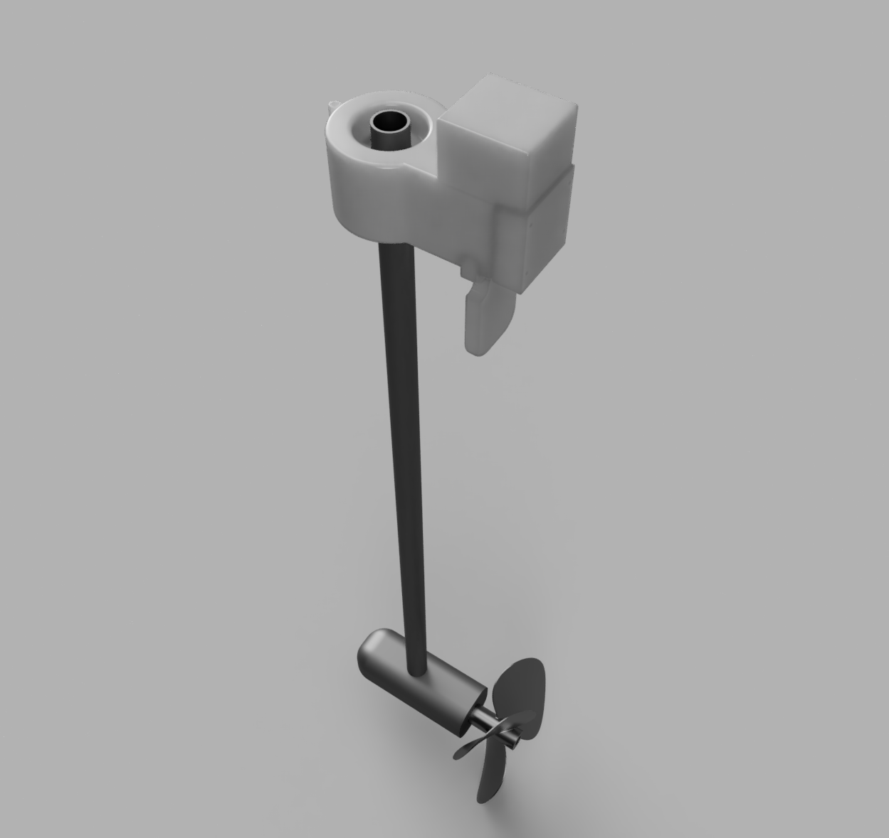
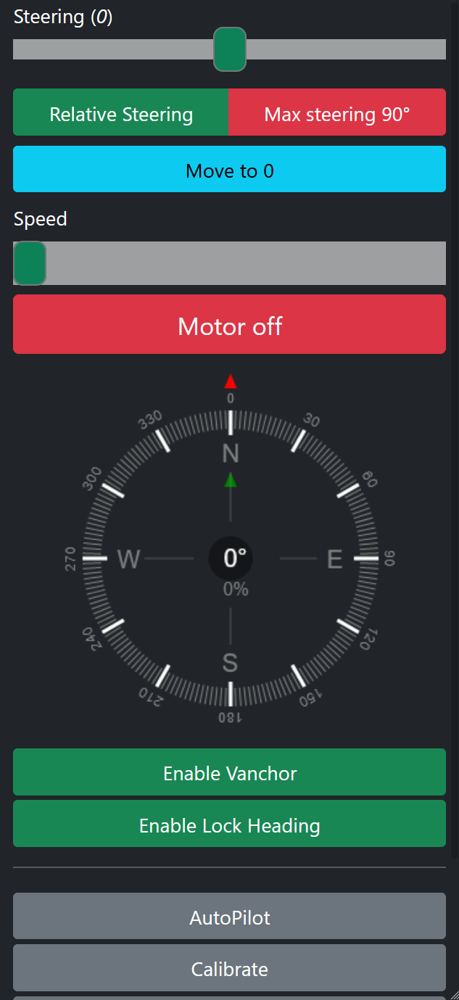
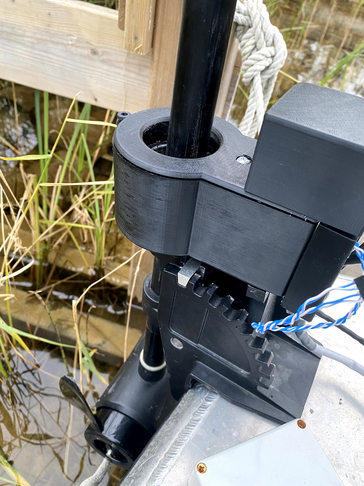

## An Open Source Trolling Motor packed with features

Vanchor is an Open Source trolling motor for smaller boats.
It's created with a goal to be cheap and easily modifiable to fit your needs.

The total cost of the project including a cheap trolling motor is around $300.

## Features

### Hold Position

Locks the boat in position by using GPS. It can be configured to an radius that fits the acuraccy of your GPS receiver.

### Hold Heading

Locks the travel towards the current magnetic heading. It has 2 different modes:

- GPS Mode - Travels in a straight line from current destination to a waypoint 1000km away with the help of the AutoPilot. This counters side-drift that might occur.
- If GPS is not available, it will use the eCompass to try to hold heading. This does not counteract sidedrift in the same way as GPS Mode.

### AutoPilot

AutoPilot reacts to NMEA APB sentences and steers the boat accordingly.
The APB sentences can be generated in 2 ways:

1. From a plotter, like a Garmin, Humminbird or OpenCPL
2. From a GPX file with waypoints

### NMEA server

Can send and receive NMEA to apps like Navionics, iNavX or SignalK

### Web interface

Vanchor is controlled through a web interface with bootstrap and JS. 

---

## Images

More comming soon...

---
